# Linux 操作系统

## 1.Linux的引言

Linux是一套免费使用和自由传播的类Unix操作系统，是一个基于`POSIX和Unix`的`多用户`、`多任务`、`支持多线程和多CPU的操作系统`。伴随着互联网的发展，`Linux得到了来自全世界软件爱好者、组织、公司的支持`。它除了在`服务器操作系统`方面保持着强劲的发展势头以外，在个人电脑、嵌入式系统上都有着长足的进步。目前Linux存在着许多不同的Linux发行版本，`但它们都使用了Linux内核`。Linux可安装在各种计算机硬件设备中，比如手机、平板电脑、路由器、台式计算机。

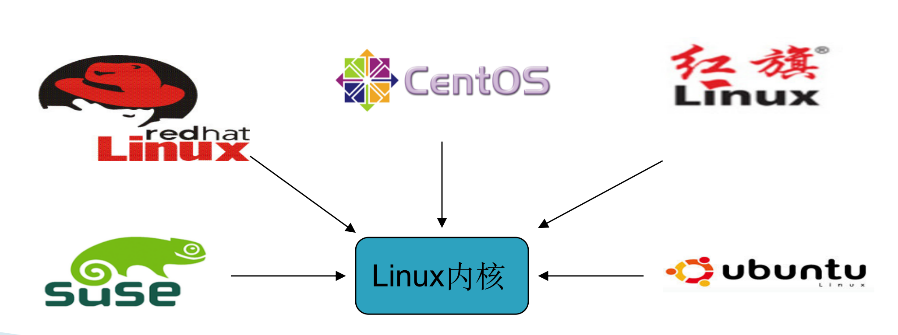

----

## 2.Linux的诞生

20世纪80年代，计算机硬件的性能不断提高，PC的市场不断扩大，当时可供计算机选用的操作系统主要有Unix、DOS和MacOS这几种。Unix价格昂贵，不能运行于[PC](https://baike.baidu.com/item/PC/107)；[DOS](https://baike.baidu.com/item/DOS/32025)显得简陋，且源代码被软件厂商严格保密；

[MacOS](https://baike.baidu.com/item/MacOS/8654551)是一种专门用于苹果计算机的操作系统。此时，计算机科学领域迫切需要一个更加完善、强大、廉价和完全开放的操作系统。由于供教学使用的典型操作系统很少，因此当时在荷兰教授的美国人AndrewS.Tanenbaum编写了一个操作系统，名为[MINIX](https://baike.baidu.com/item/MINIX/7106045)，为了向学生讲述操作系统内部工作原理。MINIX虽然很好，但只是一个用于教学目的的简单操作系统，而不是一个强有力的实用操作系统，然而最大的好处就是公开源代码。`全世界学计算机的学生都通过钻研MINIX源代码来了解电脑里运行的MINIX操作系统，芬兰赫尔辛基大学大学二年级的学生Linus Torvalds就是其中一个，在吸收了MINIX精华的基础上，Linus于1991年写出了属于自己的Linux操作系统，版本为Linux0.01，是Linux时代开始的标志`。`他利用Unix的核心，去除繁杂的核心程序，改写成适用于一般计算机的x86系统，并放在网络上供大家下载，1994年推出完整的核心Version1.0，至此，Linux逐渐成为功能完善、稳定的操作系统，并被广泛使用。`

> `总结`:Linux出现于`1991年`，是由`芬兰赫尔辛基大学学生`,`Linus Torvalds`和后来加入的众多爱好者共同开发完成。
>
> Linux   要求: linux 永远开源 且 免费试用
>
> git 作者  天才   bitkeeper===> 不给你们  c  两周 写一个git


----

## 3.Linux的特点

### 3.1 完全免费

Linux是一款免费的操作系统，用户可以通过网络或其他途径免费获得，并可以任意修改其[源代码](https://baike.baidu.com/item/源代码/3969)。这是其他的操作系统所做不到的。正是由于这一点，来自全世界的无数[程序员](https://baike.baidu.com/item/程序员/62748)参与了Linux的修改、编写工作，程序员可以根据自己的兴趣和灵感对其进行改变，这让Linux吸收了无数程序员的精华，不断壮大。

### 3.2 多用户、多任务

Linux支持多用户，各个用户对于自己的文件设备有自己特殊的权利，保证了各用户之间互不影响。`多任务`则是现在电脑最主要的一个特点，Linux可以使多个程序同时并独立地运行。同时``丰富的网络功能，可靠的系统安全，良好的可移植性，具有标准兼容性，出色的速度性能`。

----

## 4.Linux之CentOS

### 4.1 centos 引言

`CentOS（Community Enterprise Operating System，中文意思是社区企业操作系统）是Linux发行版之一`，它是来自于Red Hat Enterprise Linux依照[开放源代码](https://baike.baidu.com/item/开放源代码/114160)规定释出的源代码所编译而成。由于出自同样的[源代码](https://baike.baidu.com/item/源代码/3587471)，因此有些要求高度稳定性的[服务器](https://baike.baidu.com/item/服务器/100571)以CentOS替代商业版的[Red Hat](https://baike.baidu.com/item/Red Hat) Enterprise Linux使用。两者的不同，在于CentOS完全开源。

### 4.2 centos 和 readheat区别

目前的Linux操作系统主要应用于生产环境，`主流企业的Linux系统仍旧是RedHat或者CentOS`,他们出自于同样的源代码,但centos完全免费。其独有的yum命令支持在线升级，可以即时更新系统，不像RedHat 那样需要花钱购买支持服务！

---

## 5.安装 Cent OS

### 5.1 环境准备

```markdown
# 环境要求:
		1. windows7+
		2. VMware Workstation8+,
		3. CentOS系统(镜像)
```

### 5.2 安装Cent OS

```markdown
# 0.下载centos 
```

> [官网](https://www.centos.org/):https://www.centos.org/
>
> [官网的下载地址](http://isoredirect.centos.org/centos/7/isos/x86_64/):http://isoredirect.centos.org/centos/7/isos/x86_64/

```markdown
# 1.第一步:打开VMware Workstation
```

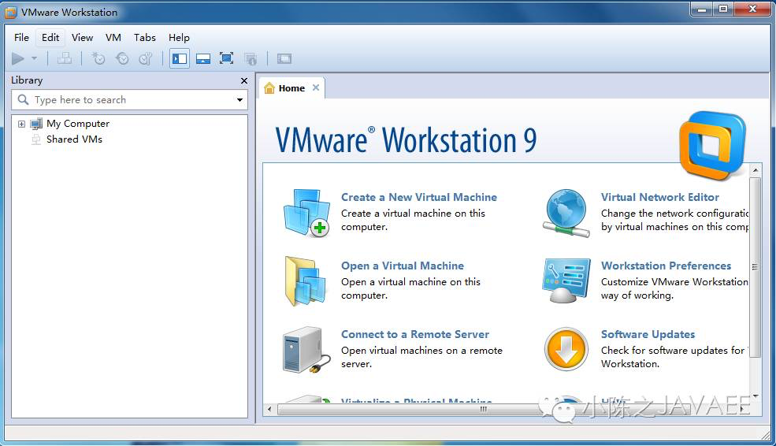

```markdown
# 2.选择菜单File的第一项新建虚拟机
```

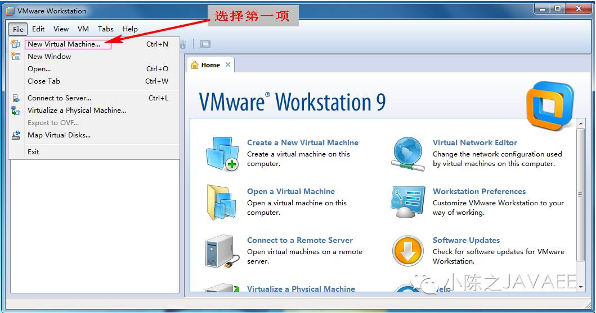

```markdown
# 3.选择自定义虚拟机安装
```

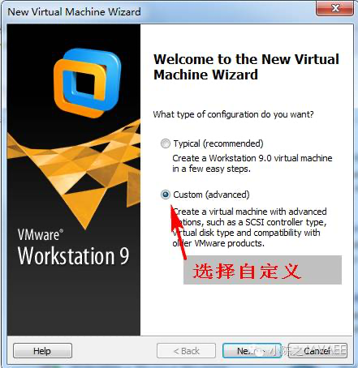

```markdown
# 4.选择下一步
```

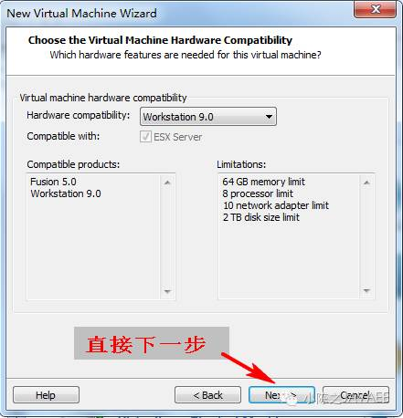

```markdown
# 5. 虚拟机设置之后安装系统
```

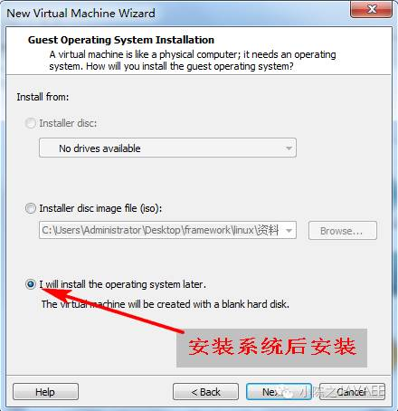

```markdown
# 6.选择虚拟机安装系统以及版本
```

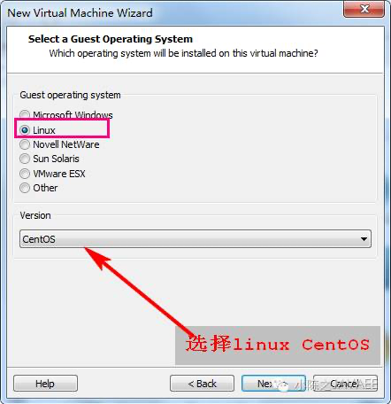

```markdown
# 7.选择虚拟机名称与位置
```

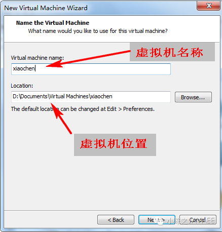

```markdown
# 8.设置处理器数
```

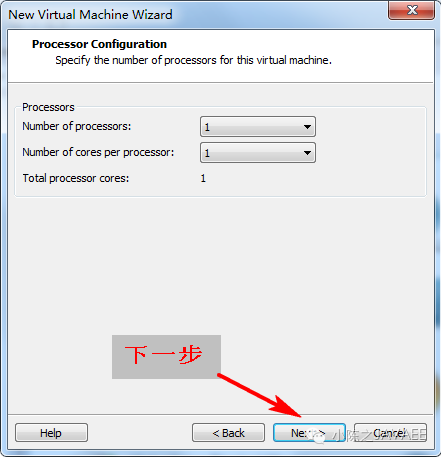

```markdown
# 9.设置虚拟机内存
```

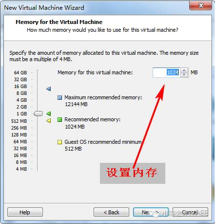

```markdown
# 10.选择网络模式
```

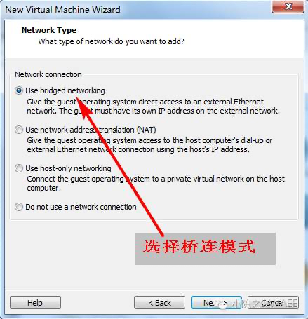

```markdown
# 11.选择io总线 下一步
```

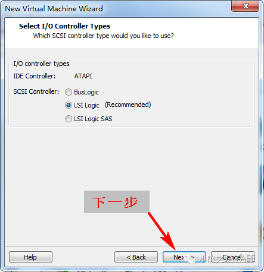

```markdown
# 12.选择新建硬盘
```

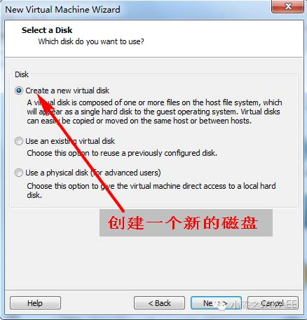

```markdown
# 13.选择硬盘类型
```

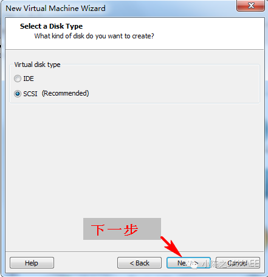

```markdown
# 14.拆分硬盘
```

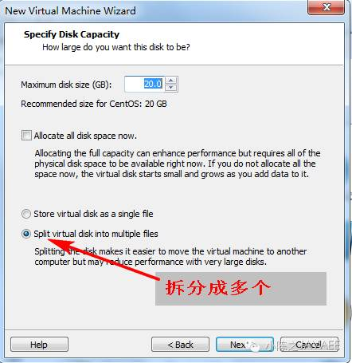

```markdown
# 15.设置磁盘位置
```

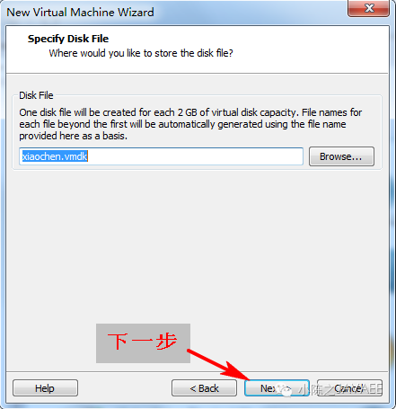

```markdown
# 16.创建完成
```

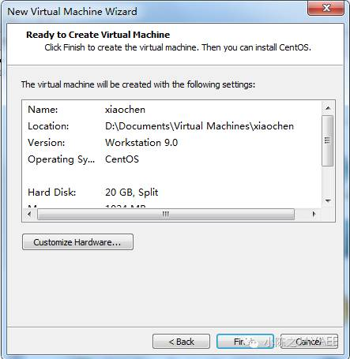

-----

## 6.Linux中目录结构


```markdown
# 目录结构	
	bin  (binaries)存放二进制可执行文件																									 [重点]
	sbin  (super user binaries)存放二进制可执行文件，只有root才能访问
	etc (etcetera)存放系统配置文件																											[重点]
	usr  (unix shared resources)用于存放共享的系统资源  																	[重点]
	home 存放用户文件的根目录																														[重点]
	root  超级用户目录																															   [重点]
	dev (devices)用于存放设备文件
	lib  (library)存放跟文件系统中的程序运行所需要的共享库及内核模块
	mnt  (mount)系统管理员安装临时文件系统的安装点
	boot 存放用于系统引导时使用的各种文件
	tmp  (temporary)用于存放各种临时文件																							   [重点]
	var  (variable)用于存放运行时需要改变数据的文件

```

---

## 7. Linux中常用指令

```markdown
# Linux中命令格式:
		命令  [-选项]  [参数]    如:  ls -l /usr 
		ls 
		ls -a   显示所有文件 包含隐藏文件 
		注意: 在linux系统中.口头文件都是隐藏文件
		ls -l   长格式显示当前目录中文件和目录  ===> ll
		ls -l  目录
		cd  名录名   切换目录
		pwd print work directory 打印工作目录 显示当前所在位置
		clear 命令清除屏幕
```

> `注意:在linux中命令严格区分大小写`

### 7.1 ls 命令 list 列表

```markdown
# ls  显示文件和目录列表	(list)
	ls  选项  参数(指定目录)
	常用选项:  
		-l (long)	 长格式显示文件和目录信息
		-a (all)	 显示所有文件和目录(包含隐藏文件和目录) .开头隐藏文件
		-R         递归显示指定目录下的文件清单，即会显示指定目录分支内各子目录中的文件清单。 

# linux系统中查看命令帮助
	man 命令    查看对应命令辅助文档
```

```shell
# 0. ls (查看目录下文件和目录)
[root@localhost ~]# ls
aa  aa.txt

# 1. ls -l (长格式展示文件)  ===> ll
[root@localhost ~]# ls -l
总用量 60
drwxrwxr-x      2   user1  user1    4096    Aug 17 09:10 abc
- rw- r-- r--    1   user1  user1    17     Aug 17 09:04 host.conf
- rw- r-- r--    1   user1  user1    38450  Aug 17 09:04 php.ini

`长格式含义:`
文件类型 文件权限   链接数  属主    属组    大小   日期   时间    文件名
d     rwxrwxr-x     2     user1  user1 4096  Aug 17 09:10  abc

# 2. ls -a (显示所有文件)
[root@localhost ~]# ls -a
.   aa      .bash_history  .bash_profile  .cshrc  .tcshrc
..  aa.txt  .bash_logout   .bashrc        .pki    .viminfo

# 3. ls -R (递归显示文件)
[root@localhost ~]# ls -R
.:
aa  aa.txt

./aa:
```

### 7.2 操作文件命令 重点

```markdown
# 0.cd 用来切换目录
	- cd 回到当前登陆用户家目录 root用户的home目录为 /root 
		等价于 cd ~  等价于 cd /root
	- cd 目录名  代表切换到指定目录

# 1.pwd 显示当前工作目录（print working directory）
	
# 2.touch 创建空文件				                    
	- touch 文件名  创建一个空文件==> touch aa.txt spring.xml 

# 3.mkdir 创建目录（make directory）
		-p 父目录不存在情况下先生成父目录 （parents）
	- mkdir 目录名  创建一个空目录  注意:只能创建一级目录	
	- mkdir -p 目录名  递归创建目录 注意:这种方式可以创建多级不存在目录

# 4.cp 复制文件或目录（copy）
		-r 递归处理，将指定目录下的文件与子目录一并拷贝（recursive）
	- cp 文件名    目标目录名  作用:将指定文件放入指定目录中
	- cp -r 源目录名  目标目录名  作用:将指定目录复制到目标目录中

# 5.mv 移动文件或目录、文件或目录改名（move）
			mv 目标文件名    新文件名          文件改名
			mv 目标文件名    目标目录名     	 文件移动
			mv 目标目录名    不存在目录名      目录改名   
      mv 目标目录名	  已存在目录名      目录移动

# 6.rm 删除文件（remove）
			-r 同时删除该目录下的所有文件（recursive）
			-f 强制删除文件或目录（force）
	- rm 文件名   带有友情提醒删除文件
	- rm -f 文件名 强制删除没有提醒 谨慎操作
	- rm -r 目录名 带有友情提醒递归删除目录以及目录中文件和目录
	- rm -rf 目录名 强制递归删除该目录中所有内容  谨慎操作
	- rm -rf 通配符 *  代表0---任意多个字符

# 7.rmdir 删除空目录（remove directory）
	- rmdir 删除一个空目录

# 8.cat 显示文本文件内容 （catenate）
	- cat  文件名 用来查看该文件内容 一般用于文件内容不超过一个屏幕的文件查看

# 9.more、less 分页显示文本文件内容
	- more 文件名 采用百分比查看    只能始终向下查看按一次回车向下查看一行
	- less 文件名 翻页形式查看文件  利用pageup pagedown进行翻页

# 10.head、tail查看文本中开头或结尾部分的内容
		- head  -n  5  a.log 查看a.log文件的前5行
		- tail 文件名 查看文件末尾 默认10行
# 11.tail  -f  b.log 循环读取（follow）
		- tail -f 文件名  实时查看改文件变化
# 12.echo 输出命令
			echo   I love baby								说明:用来向屏幕输出一句话
			echo   $PATH                      说明:用来输出系统环境变量的值
			echo I Love baby  >  aa.txt			  说明:将这段内容输入到 文件中
```

### 7.3 网络相关命令

```markdown
# 1.ip addr 查看IP地址
	- ip addr  centos7 独有ip查看     ens33(默认存在一块网卡)==> ip a
	- ifconfig 用来查看linux系统ip地址  eth0(默认网卡) 

# 2.ping 测试网络连通性
		ping 192.168.0.1

# 3.让现有centos系统动态ip地址
	1.vi /etc/sysconfig/network-scripts/ifcfg-ens33 
	2.进入之后按一下键盘上 i 切换编辑模式 修改为yes
	3.按一下键盘esc 按键
	4.输入 :wq 保存退出
	5.重启系统
```

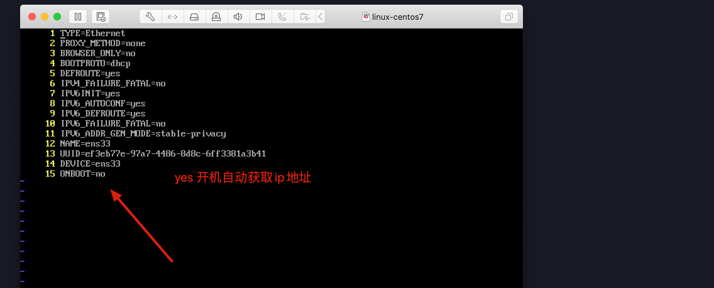

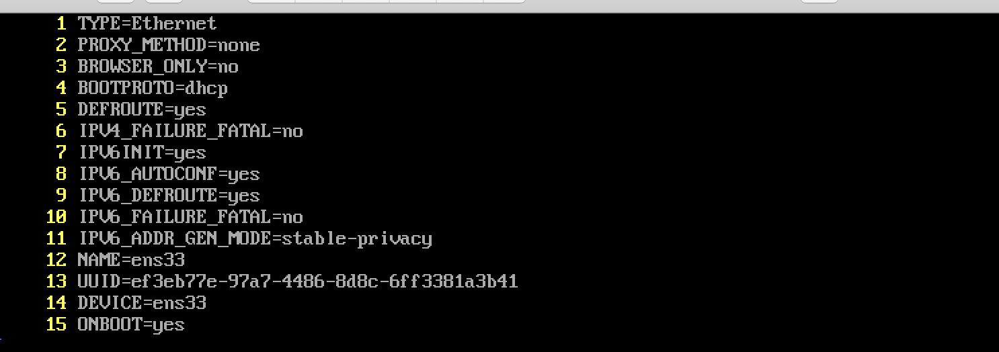

### 7.4 tar命令

```markdown
# tar命令
		-c 建立一个压缩文件的参数指令（create）
		-x 解开一个压缩文件的参数指令（extract）
		-z 是否需要用 gzip 压缩
		-v 压缩的过程中显示文件（verbose）
		-f 使用档名，在 f 之后要立即接档名（file）

`通常组合使用:`
			tar -cvf aaa.tar file1.txt file2.txt 					将file1和2打包成aaa.tar
			tar -zcvf aaa.tar.gz file1.txt file2.txt 			将file1和2打包成aaa.tar并压缩
			tar -zxvf aaa.tar.gz file1.txt file2.txt 			将aaa.tar.gz解压
```

### 7.5 systemctl 服务命令

```markdown
# systemctl

	systemctl status 服务名          说明:查看某个服务的运行状态
	systemctl start 服务名 					说明:启动某个服务
	systemctl restart 服务名 				说明:重启某个服务
	systemctl stop 服务名 						说明:停止某个服务
```

### 7.6 进程相关命令

```markdown
# 1.ps 询在当前控制台上运行的进程
		ps  -aux   说明:查询系统中所有运行的进程，包括后台进程，其中参数a是所有进程，参数x包括不占用控制台的进程，参数u显示用户。
		ps  -ef		 说明:查询系统中所有运行的进程，包括后台进程，而且可以显示出每个进程的父进程号。

# 2.top	命令  动态显示系统进程

# 3.kill 杀死进程
		kill  3029 说明：上述命令中3029是进程号；一般在执行kill命令之前，先用ps或pstree来查询一下将要被杀掉的进程的进程号。 
		kill  -9  3029 说明:强制终止3029号进程的运行，其中参数-9代表强制的意思,实际上kill命令是向该进程发送信号，
												该进程接到信号后决定是否停止运行，有些守护进程必须要收到参数9才终止运行。
		
```

### 7.7 vi命令

```markdown
# vi / vim是Unix / Linux上最常用的文本编辑器而且功能非常强大。
```


```markdown
# 常用命令:

		i						在光标前插入
 		I						在光标当前行开始插入
 		a						在光标后插入
 		A						在光标当前行末尾插入
 		o						在光标当前行的下一行插入新行
 		O						在光标当前行的上一行插入新行
 		----------------重点---------------------------
 		:set nu			显示行号
 		:set nonu		取消行号
 		gg					到文本的第一行
 		G						到文本的最后一行
 		:n					到文本的第n行
 		------------------重点-------------------------
 		u						undo,取消上一步操作
 		Ctrl + r		redo,返回到undo之前
 		-------------------重点------------------------
 		Shift+ zz		保存退出，与“:wq”作用相同
		:q					退出不保存
		:q!					强制退出不保存
		:wq					保存退出
		:wq!				强制保存退出
```

### 7.8 软件相关命令

`RPM命令`

> ​	`RPM是RedHat Package Manager（RedHat软件包管理工具）的缩写，这一文件格式名称虽然打上了RedHat的标志，但是其原始设计理念是开放式的，现在包括RedHat、CentOS、SUSE等Linux的分发版本都有采用，可以算是公认的行业标准了。RPM文件在Linux系统中的安装最为简便,`

```markdown
# rpm 命令  
	常用参数:
      i：安装应用程序（install）
      e：卸载应用程序（erase）
      vh：显示安装进度；（verbose   hash） 
      U：升级软件包；（update） 
      qa: 显示所有已安装软件包（query all）
	例子：rmp  -ivh  gcc-c++-4.4.7-3.el6.x86_64.rpm

```

`YUM命令`

> ​	`Yum（全称为 Yellow dog Updater, Modified）是一个在Fedora和RedHat以及SUSE、CentOS中的Shell前端软件包管理器。基於RPM包管理，能够从指定的服务器自动下载RPM包并且安装，可以自动处理依赖性关系，并且一次安装所有依赖的软件包，无须繁琐地一次次下载、安装。`

```markdown
例子：
    yum  install  gcc-c++
    yum  remove   gcc-c++
    yum  update   gcc-c++
```

> `使用YUM命令必须连接外部网络`

### 7.9 用户和组相关命令

```markdown
# 1.查看当前用户：whoami
# 2.查看登录用户：who
	-m或am I	只显示运行who命令的用户名、登录终端和登录时间
	-q或--count	只显示用户的登录账号和登录用户的数量
# 3.退出用户:		exit
# 4.添加、删除组账号：groupadd、groupdel
# 5.添加用户账号：useradd
		-g	指定组名称  说明:如果创建用户的时候，不指定组名，那么系统会自动创建一个和用户名一样的组名。
# 6.设置用户密码：passwd　[用户名]
# 7.su 切换用户
		su  root 
```

### 7.10 权限相关命令

> Linux文件有`三种`典型的权限，`即r读权限、w写权限和x执行权限`。在长格式输出中在文件类型的后面有9列权限位，实际上这是针对不同用户而设定的。`r=4，w=2，x=1`

```markdown
# chmod
	字母法：chmod u/g/o/a +/-/= rwx 文件
	
    [ u/g/o/a ]	含义
    	u	user 					表示该文件的所有者
    	g	group 				表示与该文件的所有者属于同一组( group )者，即用户组
    	o	other 				表示其他以外的人
    	a	all 					表示这三者皆是

    [ +-= ]	含义
    	+								增加权限
    	-								撤销权限
    	=								设定权限

    rwx	含义
    	r								read 表示可读取，对于一个目录，如果没有r权限，那么就意味着不能通过ls查看这个目录的内容。
    	w								write 表示可写入，对于一个目录，如果没有w权限，那么就意味着不能在目录下创建新的文件。
    	x								excute 表示可执行，对于一个目录，如果没有x权限，那么就意味着不能通过cd进入这个目录。
```

------------------

## 8.CRT终端操作

```markdown
# 0.准备工作
		安装CRT客户端工具,安装winscp工具

# 1.设置linux获取ip地址 (编辑网络配置文件)	
		vi /etc/sysconfig/network-scripts/ifcfg-ens33

# 2.修改ens33配置文件:
    BOOTPROTO=dhcp
    ONBOOT=yes

# 3.重启启动网路服务加载修改配置生效
		systemctl restart network

# 4.查看ip地址
		ip addr

# 5.此时ip已经获取
		ens33: <BROADCAST,MULTICAST,UP,LOWER_UP> mtu 1500 qdisc pfifo_fast state UP group default qlen 1000
    link/ether 00:0c:29:07:16:9e brd ff:ff:ff:ff:ff:ff
    inet 192.168.202.136/24 brd 192.168.202.255 scope global noprefixroute dynamic ens33
       valid_lft 1459sec preferred_lft 1459sec
    inet6 fe80::b22b:7e01:db87:52fe/64 scope link noprefixroute 

# 6.测试外部网络连通(保证宿主机windows可以上网前提)
		ping www.baidu.com

# 7.使用CRT工具连接即可
```

## 9.安装JDK

### 9.1 下载jdk

```markdown
# 1.下载jdk
	https://www.oracle.com/technetwork/java/javase/downloads/index.html

# 2.通过CRT|WinSCP工具将jdk上传到linux系统中	
```

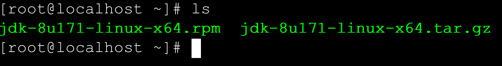

### 9.2 tar包安装

```markdown
# 1.将JDK解压缩到指定目录
	tar -zxvf jdk-8u171-linux-x64.tar.gz -C /usr/
	注意:-C参数是将JDK解压之后文件放入usr目录中

# 2.进入jdk解压缩目录查看
	cd /usr/jdk1.8.0_171/

# 3.查看详细信息
	[root@localhost jdk1.8.0_171]# ls
		bin        db       javafx-src.zip  lib      man          release  THIRDPARTYLICENSEREADME-JAVAFX.txt
		COPYRIGHT  include  jre             LICENSE  README.html  src.zip  THIRDPARTYLICENSEREADME.txt

# 4.配置环境变量
	 vi /etc/profile
	 
# 5.在文件末尾加入如下配置
	export JAVA_HOME=/usr/jdk1.8.0_171
	export PATH=$PATH:$JAVA_HOME/bin

# 6.加载配置生效
	source /etc/profile    加载配置生效
	reboot                 重启系统
	注意: 以上两个选项选择任意一个即可source可以不用重启立即生效,某些情况下source无法生效时,可以使用重启试试

# 7.测试环境变量
	java
	javac
	java -version
```

### 9.3 rpm包安装

```markdown
# 1.安装jdk
	[root@localhost ~]# rpm -ivh jdk-8u171-linux-x64.rpm 
		准备中...                          ################################# [100%]
		正在升级/安装...
   		1:jdk1.8-2000:1.8.0_171-fcs        ################################# [100%]
			Unpacking JAR files...
        tools.jar...
        plugin.jar...
        javaws.jar...
        deploy.jar...
        rt.jar...
        jsse.jar...
        charsets.jar...
        localedata.jar...

# 2.搜索默认安装位置
	 [root@localhost ~]# find / -name "java"
	 	/usr/java/jdk1.8.0_171-amd64/bin/java
		/usr/java/jdk1.8.0_171-amd64/jre/bin/java

# 3.配置环境变量
	 vi /etc/profile

# 4.在文件末尾加入如下配置
	export JAVA_HOME=/usr/java/jdk1.8.0_171-amd64/
	export PATH=$PATH:$JAVA_HOME/bin

# 5.加载配置生效
	source /etc/profile    加载配置生效
	reboot                 重启系统
	注意: 以上两个选项选择任意一个即可source可以不用重启立即生效,某些情况下source无法生效时,可以使用重启试试

# 6.测试环境变量
	java
	javac
	java -version
```

------

## 10.安装Tomcat

```markdown
# 0.下载tomcat
	http://mirrors.tuna.tsinghua.edu.cn/apache/tomcat/tomcat-8/v8.5.46/bin/apache-tomcat-8.5.46.tar.gz

# 1.通过工具上传到Linux系统中

# 2.解压缩到/usr目录中
	[root@localhost ~]# tar -zxvf apache-tomcat-8.5.46.tar.gz -C /usr/

# 3.查看解压内容
	[root@localhost apache-tomcat-8.5.46]# ls -l
    总用量 124
    drwxr-x---. 2 root root  4096 10月 13 12:27 bin
    -rw-r-----. 1 root root 19318 9月  17 02:19 BUILDING.txt
    drwx------. 2 root root   238 9月  17 02:19 conf
    -rw-r-----. 1 root root  5407 9月  17 02:19 CONTRIBUTING.md
    drwxr-x---. 2 root root  4096 10月 13 12:27 lib
    -rw-r-----. 1 root root 57011 9月  17 02:19 LICENSE
    drwxr-x---. 2 root root     6 9月  17 02:17 logs
    -rw-r-----. 1 root root  1726 9月  17 02:19 NOTICE
    -rw-r-----. 1 root root  3255 9月  17 02:19 README.md
    -rw-r-----. 1 root root  7139 9月  17 02:19 RELEASE-NOTES
    -rw-r-----. 1 root root 16262 9月  17 02:19 RUNNING.txt
    drwxr-x---. 2 root root    30 10月 13 12:27 temp
    drwxr-x---. 7 root root    81 9月  17 02:17 webapps
    drwxr-x---. 2 root root     6 9月  17 02:17 work

# 4.启动tomcat
	[root@localhost apache-tomcat-8.5.46]# ./bin/startup.sh 

# 5.关闭网络防火墙
	systemctl stop firewalld	   关闭网络防火墙
	systemctl disable firewalld  关闭开启自启动(永久关闭)

# 6.在windows中访问tomcat
	http://10.15.0.8:8080/

# 7.显示tomcat实时控制台信息
	进入tomcat的logs目录中使用tail -f catalina.out 命令实时查看控制台信息 

# 8.关闭tomcat
	在tomcat的bin目录下面使用 ./shutdown.sh
```

------

## 11.安装MySQL

### 11.1 环境准备

```markdown
# 1.卸载mariadb，否则安装mysql会出现冲突
# 2.执行命令rpm -qa | grep mariadb
# 3.列出所有被安装的mariadb rpm 包；
# 4.执行命令rpm -e --nodeps mariadb-libs-5.5.56-2.el7.x86_64
```

### 11.2 本地安装

```markdown
# 0.上传下载好的软件包到系统中
```

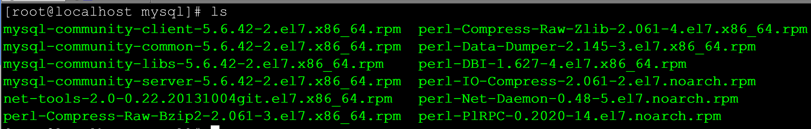

```shell
# 0.执行本地安装包之前必须先安装vim
	yum install -y vim
# 1.安装步骤
	rpm -ivh perl-*
	rpm -ivh net-tools-2.0-0.22.20131004git.el7.x86_64.rpm
	rpm -ivh mysql-community-common-5.6.42-2.el7.x86_64.rpm
	rpm -ivh mysql-community-libs-5.6.42-2.el7.x86_64.rpm
	rpm -ivh mysql-community-client-5.6.42-2.el7.x86_64.rpm
	rpm -ivh mysql-community-server-5.6.42-2.el7.x86_64.rpm
```

### 11.3 在线安装

```markdown
# 1.添加官方的yum源创建并编辑mysql-community.repo文件
		vi /etc/yum.repos.d/mysql-community.repo
# 2.粘贴以下内容到源文件中
		[mysql56-community]
    name=MySQL 5.6 Community Server
    baseurl=http://repo.mysql.com/yum/mysql-5.6-community/el/7/$basearch/
    enabled=1
    gpgcheck=0
    gpgkey=file:///etc/pki/rpm-gpg/RPM-GPG-KEY-mysql
    
    注意:如果需要安装mysql5.7只需要将baseurl修改即可 
    	baseurl=http://repo.mysql.com/yum/mysql-5.7-community/el/7/$basearch/

# 3.安装mysql
	sudo yum install mysql-community-server
```

### 11.4 设置root用户密码

```markdown
# 1.启动mysql数据库
	[root@localhost mysql]# systemctl start mysqld

# 2.修改mysql数据库密码
	mysqladmin -u root -p password 回车 输入原始密码 在输入新的密码
	
	注意:5.7之前版本安装完成之后没有密码,mysql5.7之后的版本的初始密码是随机生成的，放在了 /var/log/mysqld.log
			使用命令 grep ‘temporary password’ /var/log/mysqld.log 读出来即可
# 3.登录mysql
	[root@localhost mysql]# mysql -u root -p
```

### 11.5 开启远程访问

```markdown
# 1.安装完成mysql时,发现mysql数据库,不允许我们远程连接需要修改设置
```

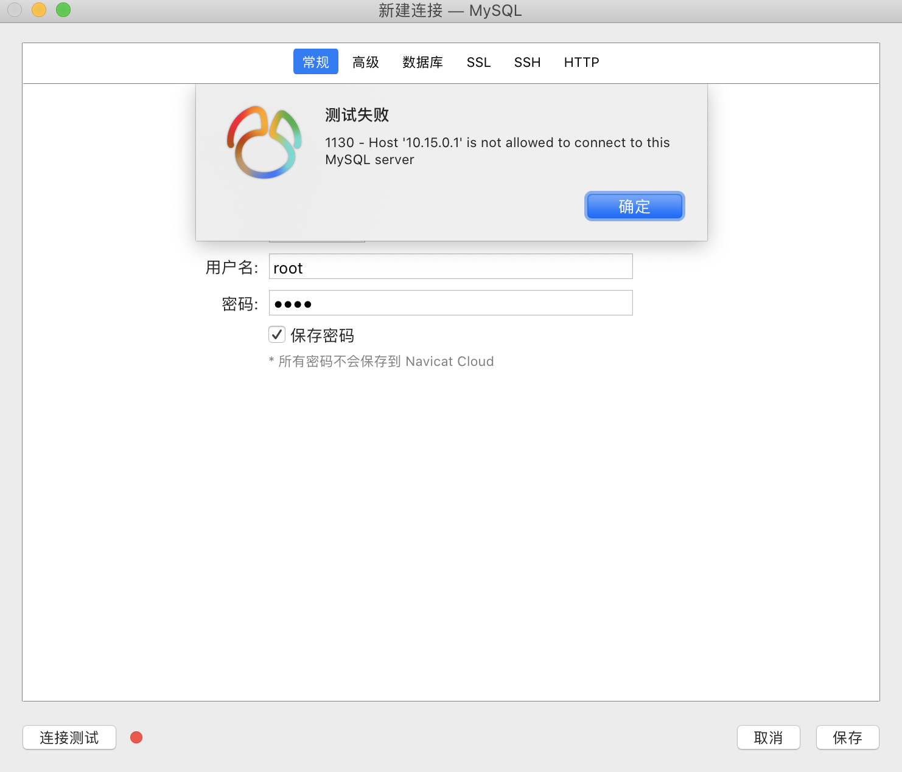

```markdown
# 2.登录mysql,并选择使用mysql数据库
```

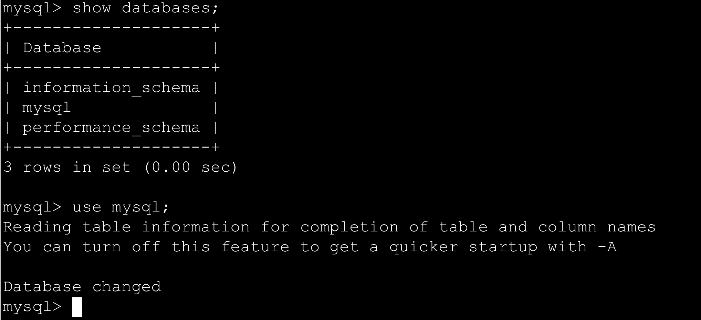

```markdown
# 3.查看mysql库中的所有表
```

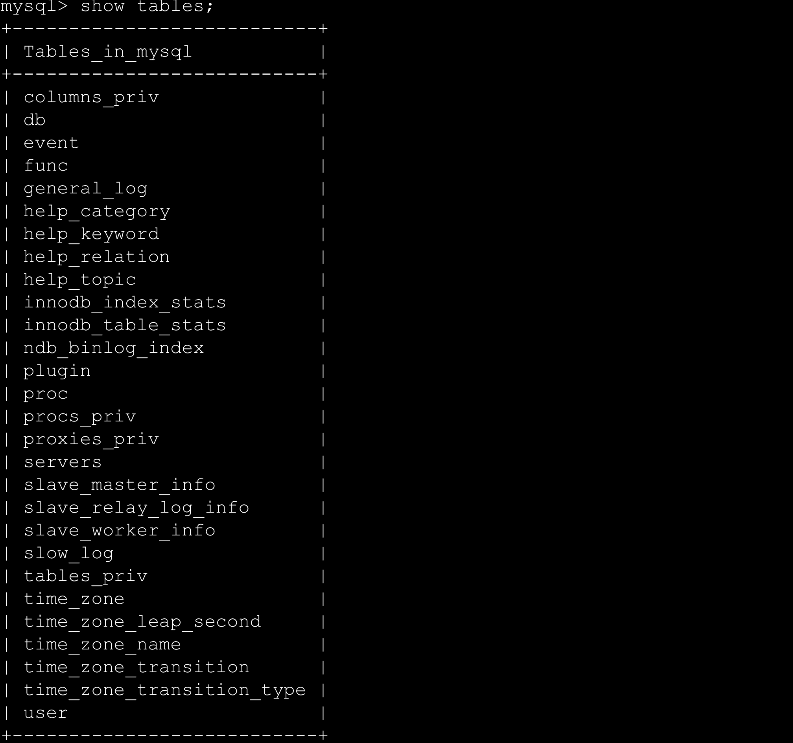

```markdown
# 4.查询user表
```

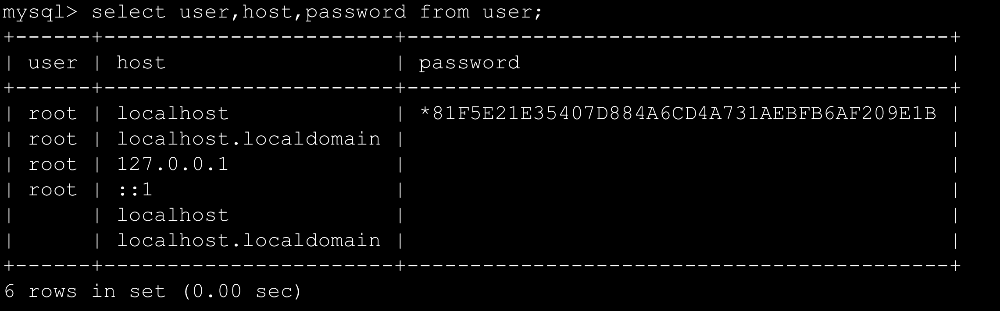

```markdown
# 5.执行如下命令
	grant all privileges on *.* to 'root'@'%' identified by 'Root!Q2w' with grant option;
```


```markdown
# 6.刷新权限
	flush privileges;
```


```markdown
# 7.重启服务
	systemctl restart mysqld
# 8.测试连接
```

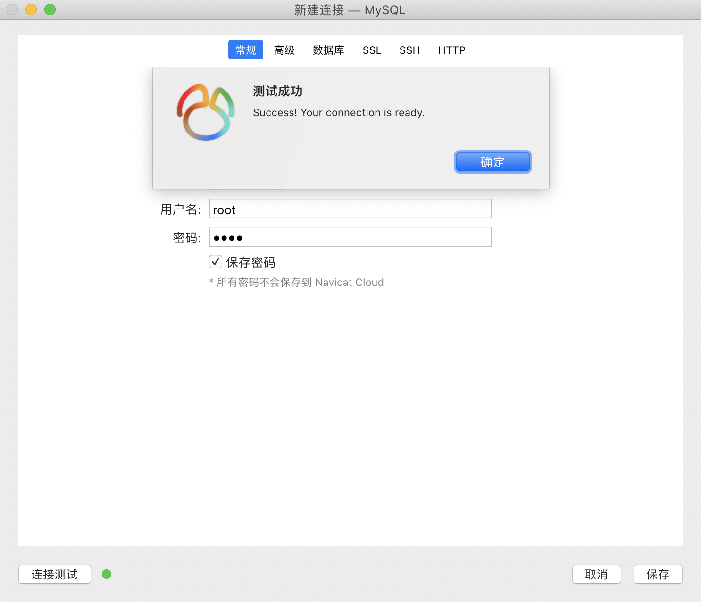

-----


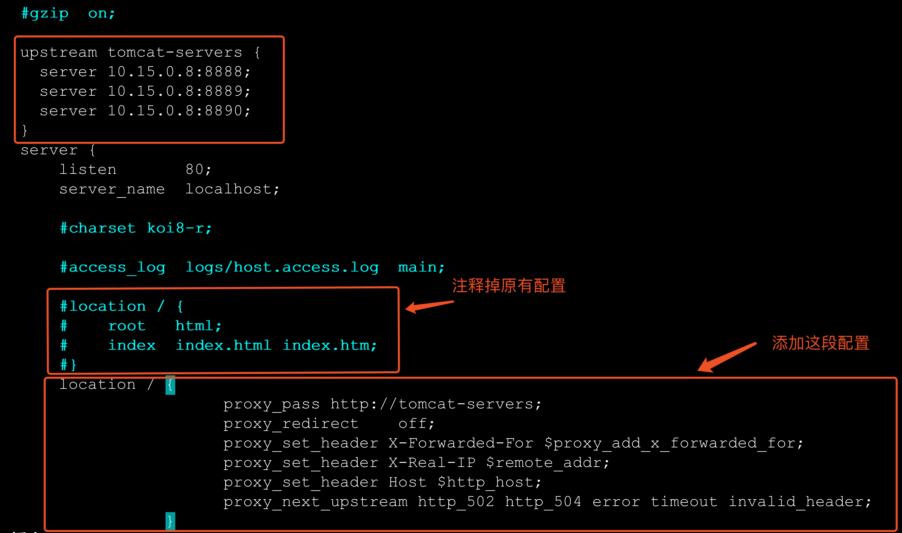

```markdown
# 9.进入nginx安装目录sbin目录启动nginx
	./nginx -c /usr/nginx/conf/nginx.conf
```

```markdown
# 10.访问nginx,看到其中一个tomcat画面:
	http://10.15.0.8/ 
```

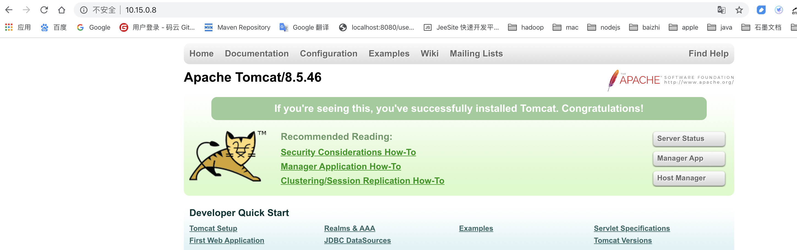

### 15.1Nginx负载均衡策略

```markdown
# 1.轮询
	 说明: 默认策略,每个请求会按时间顺序逐一分配到不同的后端服务器

# 2.weight 权重
	说明: weight参数用于指定轮询几率，weight的默认值为1,；weight的数值与访问比率成正比 
    upstream tomcat-servers {
        server localhost:8080   weight=2;  
        server localhost:8081;  
        server localhost:8082   backup;  
    }
    注意：1.权重越高分配到需要处理的请求越多。2.此策略可以与least_conn和ip_hash结合使用主要用于后端服务器性能不均

# 3.ip_hash
	　说明:指定负载均衡器按照基于客户端IP的分配方式，这个方法确保了相同的客户端的请求一直发送到相同的服务器，以保证session会话。这样每个访客都固定访问一个后端服务器，可以解决session不能跨服务器的问题。
	 
	　upstream tomcat-servers {
        ip_hash;    #保证每个访客固定访问一个后端服务器
        server localhost:8080;
        ......
    }

# 4.least_conn
	说明: 把请求转发给连接数较少的后端服务器。轮询算法是把请求平均的转发给各个后端，使它们的负载大致相同；但是，有些请求占用的时间很长，会导致其所在的后端负载较高。这种情况下，least_conn这种方式就可以达到更好的负载均衡效果。
	upstream tomcat-servers{
        least_conn;    #把请求转发给连接数较少的后端服务器
        server localhost:8080;
    }

```

----

