#  Spring Cloud Alibaba

**版本: 2.2.1**

## 1.简介

Spring Cloud Alibaba provides a one-stop solution for distributed application development. It contains all the components required to develop distributed applications, making it easy for you to develop your applications using Spring Cloud.

With Spring Cloud Alibaba, you only need to add some annotations and a small amount of configurations to connect Spring Cloud applications to the distributed solutions of Alibaba, and build a distributed application system with Alibaba middleware.

```markdown
# 0.原文翻译
- https://spring.io/projects/spring-cloud-alibaba
- 阿里云为分布式应用开发提供了一站式解决方案。它包含了开发分布式应用程序所需的所有组件，使您可以轻松地使用springcloud开发应用程序。
- 有了阿里云，你只需要添加一些注解和少量的配置，就可以将Spring云应用连接到阿里的分布式解决方案上，用阿里中间件搭建一个分布式应用系统。
```

## 2.环境搭建

```markdown
# 0.构建项目并引入依赖
```

```xml
<!--定义springcloud版本-->
<properties>
 <spring.cloud.alibaba.version>2.2.1.RELEASE</spring.cloud.alibaba.version>
</properties>

<!--全局引入springcloudalibaba下载依赖地址,并不会引入依赖-->
<dependencyManagement>
  <dependencies>
    <dependency>
      <groupId>com.alibaba.cloud</groupId>
      <artifactId>spring-cloud-alibaba-dependencies</artifactId>
      <version>${spring.cloud.alibaba.version}</version>
      <type>pom</type>
      <scope>import</scope>
    </dependency>
  </dependencies>
</dependencyManagement>
```


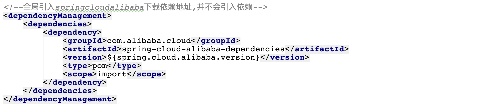

----

## 3.Nacos 服务注册中心  统一配置中心

### 什么是Nacos  Name Service & Configurations Services


```markdown
- https://nacos.io/zh-cn/index.html
- Nacos 致力于帮助您发现、配置和管理微服务。Nacos 提供了一组简单易用的特性集，帮助您快速实现动态服务发现、服务配置、服务元数据及流量管理。
```

- 总结:**Nacos就是微服务架构中服务注册中心以及统一配置中心,用来替换原来的(eureka,consul)以及config组件**

### 安装Nacos

```markdown
# 0.准备环境
- 1.64 bit OS，支持 Linux/Unix/Mac/Windows，推荐选用 Linux/Unix/Mac。
- 2.64 bit JDK 1.8+；下载 & 配置。
- 3.Maven 3.2.x+；下载 & 配置。

# 1.下载nacos [本次课程版本:][1.3.0版本]
- https://github.com/alibaba/nacos/releases 
```

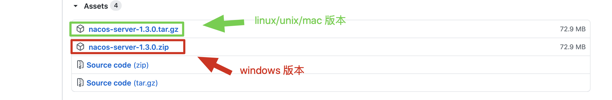

```markdown
# 2.解压缩安装包到指定位置
- bin  			启动nacos服务的脚本目录
- conf 			nacos的配置文件目录
- target 		nacos的启动依赖存放目录
- data		  nacos启动成功后保存数据的目录
```

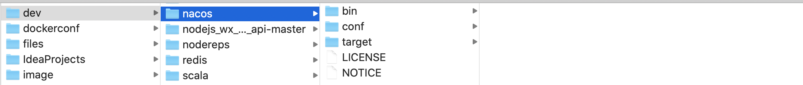

````markdown
# 3.启动安装服务
- linux/unix/mac启动
	打开终端进入nacos的bin目录执行如下命令 
	./startup.sh -m standalone

- windows启动
	在 cmd中 
	执行 startup.cmd -m standalone 或者双击startup.cmd运行文件。
````

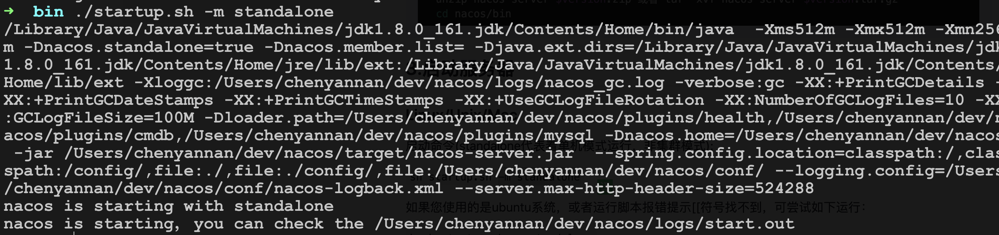

```markdown
# 4.访问nacos的web服务管理界面
- http://localhost:8848/nacos/
- 用户名 和 密码都是nacos
```

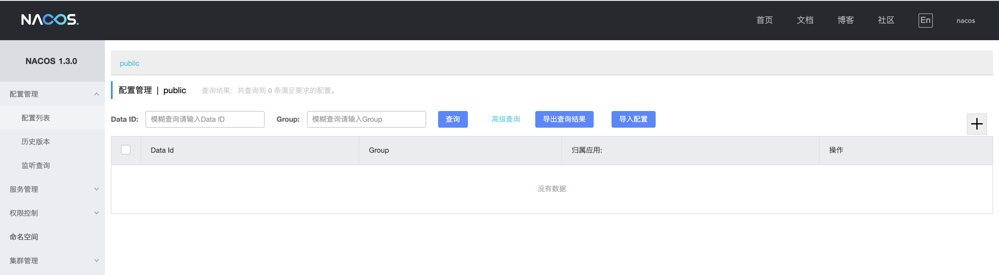

### 开发服务注册到nacos

```markdown
# 0.创建项目并引入依赖
```

```xml
<!--引入nacos client的依赖-->
<dependency>
    <groupId>com.alibaba.cloud</groupId>
    <artifactId>spring-cloud-starter-alibaba-nacos-discovery</artifactId>
</dependency>
```


```markdown
# 1.配置注册地址
```

```properties
server.port=8789 																												#指定当前服务端口
spring.application.name=nacosclient																			#指定服务名称
spring.cloud.nacos.server-addr=localhost:8848														#指定nacos服务地址
spring.cloud.nacos.discovery.server-addr=${spring.cloud.nacos.server-addr} #指定注册中心地址							
management.endpoints.web.exposure.include=*														  #暴露所有web端点
```

```markdown
# 2.加入启动服务注册注解 [注意:][新版本之后这步可以省略不写]
```

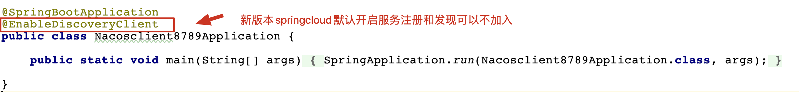

```markdown
# 3.查看nacos的服务列表
```

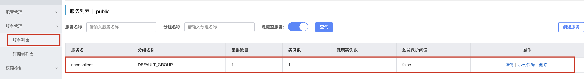

### 使用nacos作为配置中心

#### 1.从nacos获取配置

```markdown
# 1.创建项目并引入nacons配置中心依赖
```

```xml
<!--引入nacos client 依赖-->
<dependency>
  <groupId>com.alibaba.cloud</groupId>
  <artifactId>spring-cloud-starter-alibaba-nacos-discovery</artifactId>
</dependency>

<!--引入配置中心依赖-->
<dependency>
   <groupId>com.alibaba.cloud</groupId>
   <artifactId>spring-cloud-starter-alibaba-nacos-config</artifactId>
</dependency>

```


```markdown
# 2.配置配置中心地址
```

```properties
spring.cloud.nacos.server-addr=localhost:8848								# 远程配置中心的地址
spring.cloud.nacos.config.server-addr=${spring.cloud.nacos.server-addr}   # 去指定nacos地址读取配置
spring.cloud.nacos.config.group=DEFAULT_GROUP								# 读取配置的分组
spring.cloud.nacos.config.file-extension=properties					# 指定读取文件后缀
spring.application.name=config															# 指定读取文件的前缀
spring.profiles.active=prod																	# 指定读取文件的具体环境
```


```markdown
# 3.在nacos中创建配置
```

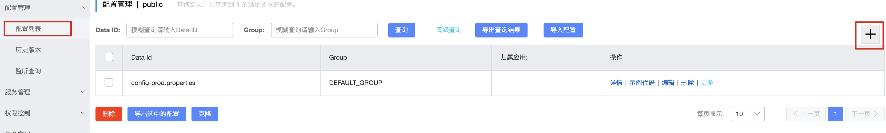

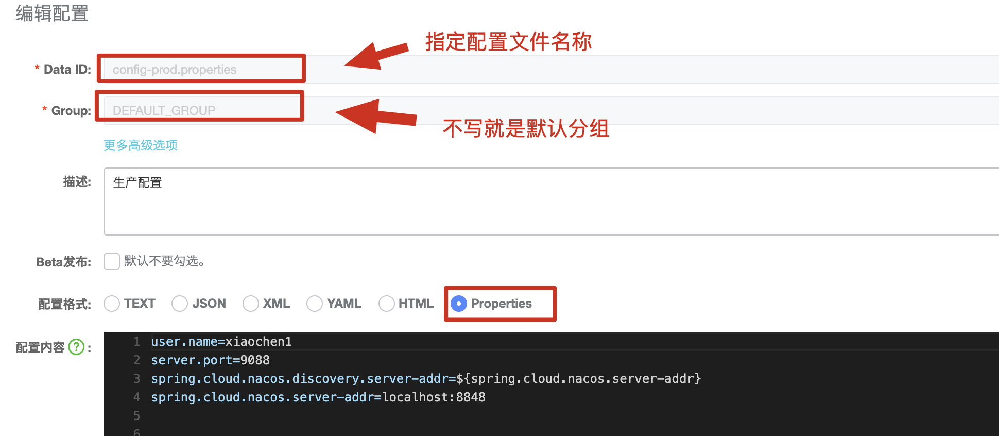

```markdown
# 4.编写控制器测试配置读取情况
```

```java
@RestController
@Slf4j
public class HelloController {
    //注入配置
    @Value("${user.name}")
    private String username;
    @GetMapping("/hello/config")
    public String config(){
        log.info("用户名: [{}]",username);
        return username;
    }
}
```

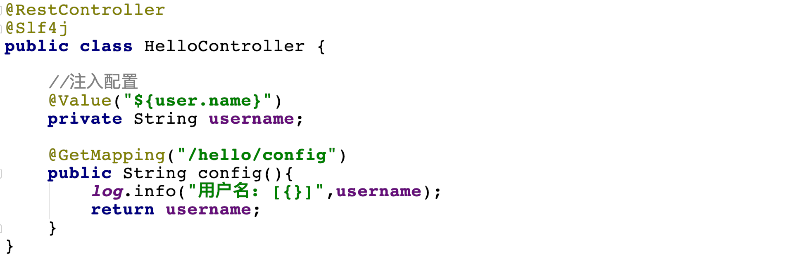

```markdown
# 5.启动项目方式测试配置读取
```

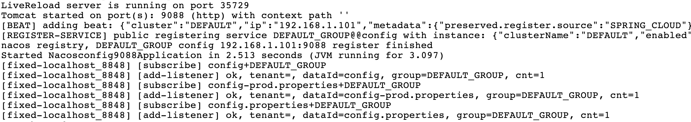

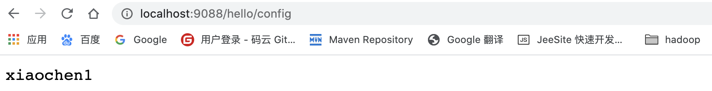

#### 2. DataId

```markdown
# 1.DataId
- 用来读取远程配置中心的中具体配置文件其完整格式如下:
- ${prefix}-${spring.profile.active}.${file-extension}
	a. prefix 默认为 spring.application.name 的值，也可以通过配置项 spring.cloud.nacos.config.prefix来配置。
	
	b. spring.profile.active 即为当前环境对应的 profile，详情可以参考 Spring Boot文档。 注意：当 spring.profile.active 为空时，对应的连接符 - 也将不存在，dataId 的拼接格式变成 ${prefix}.${file-extension}
	
	c. file-exetension 为配置内容的数据格式，可以通过配置项 spring.cloud.nacos.config.file-extension 来配置。目前只支持 properties 和 yaml 类型。
```

#### 3.实现自动配置刷新

```markdown
# 1.自动刷新
- 默认情况下nacos已经实现了自动配置刷新功能,如果需要刷新配置直接在控制器中加入@RefreshScope注解即可
```

```java
@RestController
@Slf4j
@RefreshScope
public class HelloController {
    //注入配置
    @Value("${user.name}")
    private String username;
    @GetMapping("/hello/config")
    public String config(){
        log.info("用户名: [{}]",username);
        return username;
    }
}
```

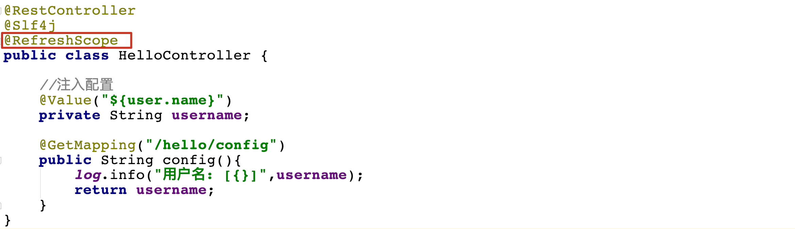

#### 4.命名空间

```markdown
# 1.命名空间(namespace)
- https://github.com/alibaba/spring-cloud-alibaba/wiki/Nacos-config
- namespace命名空间是nacos针对于企业级开发设计用来针对于不同环境的区分,比如正在企业开发时有测试环境,生产环境,等其他环境,因此为了保证不同环境配置实现隔离,提出了namespace的概念,默认在nacos中存在一个public命名空间所有配置在没有指定命名空间时都在这个命名空间中获取配置,在实际开发时可以针对于不能环境创建不同的namespace空间。默认空间不能删除!
```

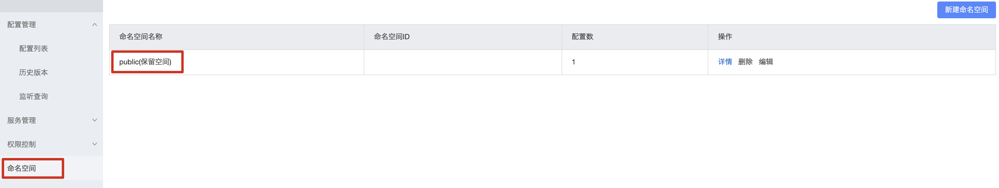

```markdown
# 2.创建其他命名空间
- 每个命名空间都有一个唯一id,这个id是读取配置时指定空间的唯一标识
```

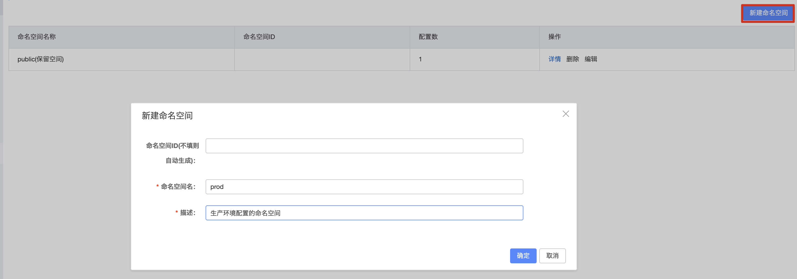

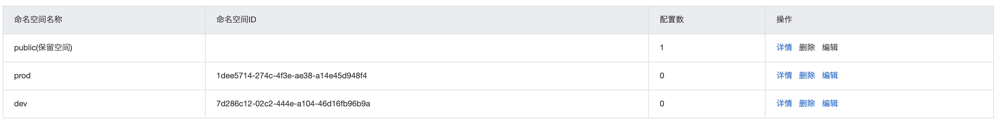

```markdown
# 3.在配置列表查看空间
```

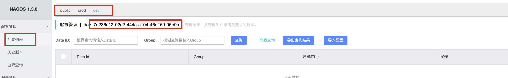

```markdown
# 4.在指定空间下载创建配置文件
```

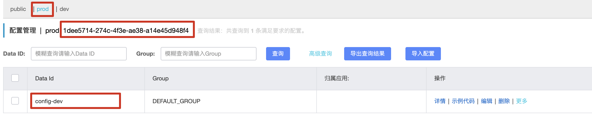

```markdown
# 5.项目中使用命名空间指定配置
```

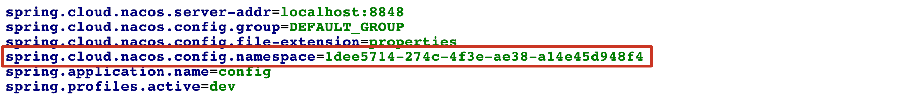

```markdown
# 6.测试配置
```

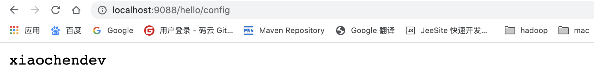

#### 5.配置分组

```markdown
# 1.配置分组(group)
- 配置分组是对配置集进行分组，通过一个有意义的字符串（如 Buy 或 Trade ）来表示，不同的配置分组下可以有相同的配置集（Data ID）。当您在 Nacos 上创建一个配置时，如果未填写配置分组的名称，则配置分组的名称默认采用 DEFAULT_GROUP 。配置分组的常见场景：可用于区分不同的项目或应用，例如：学生管理系统的配置集可以定义一个group为：STUDENT_GROUP。
```


```markdown
# 2.创建分组
```

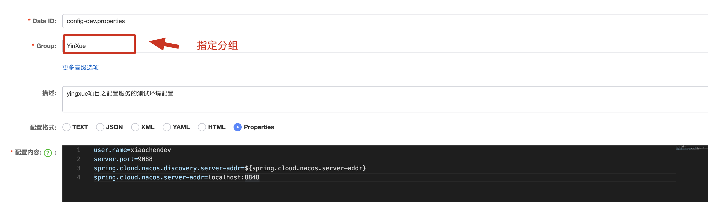

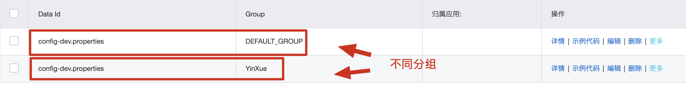

```markdown
# 3.读取不同分组的配置
```

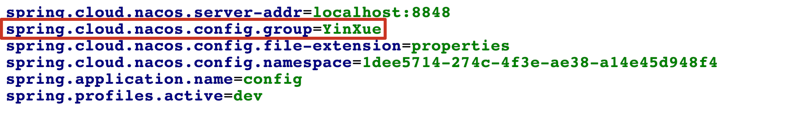

---

#### 6.数据持久化

##### 安装Mysql

~~~markdown
# 0.在centos7安装
- a)卸载mariadb，否则安装mysql会出现冲突
- b)执行命令 rpm -qa | grep mariadb 搜索mariadb
- c)列出所有被安装的mariadb rpm 包
- d)执行命令rpm -e --nodeps mariadb-libs-5.5.56-2.el7.x86_64
~~~

**在线安装**

~~~shell
#1.添加官方的yum源创建并编辑mysql-community.repo文件
#2.vi /etc/yum.repos.d/mysql-community.repo

#3.粘贴以下内容到源文件中

[mysql57-community]
name=MySQL 5.7 Community Server
baseurl=http://repo.mysql.com/yum/mysql-5.7-community/el/7/$basearch/		
enabled=1
gpgcheck=0
gpgkey=file:///etc/pki/rpm-gpg/RPM-GPG-KEY-mysql

#注意:如果需要安装mysql5.7 只需要将baseurl修改即可
baseurl=http://repo.mysql.com/yum/mysql-5.7-community/el/7/$basearch/

#4.安装mysql数据库
yum -y install mysql-community-server
~~~

**启动Mysql服务**

~~~shell
#安装mysql完成之后会在系统中自动添加一个mysqld服务

启动: systemctl start mysqld
关闭:	systemctl stop mysqld
重启:	systemctl restart mysqld
状态:	systemctl status mysqld
~~~

**登陆Mysql**

~~~markdown
# 1.先设置root的用户密码
    注意:  //root h%Gq:k&zb3oX
    mysql 5.6 安装完成之后没有默认密码
    mysql 5.7 安装完成之后生成临时密码,
    使用命令 grep 'temporary password' /var/log/mysqld.log 读出来即可
# 2.修改密码
    mysqladmin -u root -p password   
    5.6 没有原密码直接回车
    5.7 有原密码,需要写出查询到的原密码    新密码：Root!@12
# 3.登录MySql
    mysql -u用户名 -p密码
    mysql -uroot -proot
# 4.查询 mysql中有哪些库
    show databases;
~~~

**开启远程访问权限**

~~~markdown
# 1.连接之前需要关闭Linux服务器中的防火墙
	systemctl stop firewalld
	systemctl disable firewalld

# 2.选择使用mysql中MySQL库
	use mysql;
# 3.	变更host中的localhost 
    grant all privileges on *.* to 'root'@'%' identified by 'Root!@12' with grant option;
# 4.修改完成后刷新mysql的权限
		flush privileges;
# 5.Navicat连接远程MySql,新建的表编码格式设置为utf-8
~~~

##### 修改Nacos配置文件

~~~properties
# 1.进入Nacos的conf目录中修改application.properties配置文件

vim application.properties

#修改内容如下:
#*************** Config Module Related Configurations ***************#
### If use MySQL as datasource:
spring.datasource.platform=mysql

### Count of DB:
db.num=1

### Connect URL of DB:
db.url.0=jdbc:mysql://127.0.0.1:3306/nacos_config?characterEncoding=utf8&connectTimeout=1000&socketTimeout
=3000&autoReconnect=true&useUnicode=true&useSSL=false&serverTimezone=UTC
db.user=root
db.password=111111
~~~

##### 从新启动Nacos

~~~shell
#1.关闭原有Nacos服务
#2.进入nacos的bin执行
./startup.sh -m standalone
~~~

#### 7.Nacos集群搭建

##### 集群规划

~~~shell
Nginx:192.168.112.108:9098
Nacos01:192.168.112.108:8846
Nacos02:192.168.112.108:8847
Nacos03:192.168.112.108:8848
Mysql:192.168.112.108:3306
~~~

##### 解压Nacos安装包

~~~shell
# 1.创建nacoscluster目录
mkdir nacoscluster

# 2.将nacos解压至nacoscluster文件夹中
tar -zxvf nacos-server-1.3.1.tar.gz -C nacoscluster/
~~~

##### 修改Nacos数据库配置

~~~properties
# 1.进入nacos的conf目录中修改配置文件
vim application.properties

#*************** Config Module Related Configurations ***************#
### If use MySQL as datasource:
spring.datasource.platform=mysql

### Count of DB:
db.num=1

~~修改如下内容：~~
#*************** Config Module Related Configurations ***************#
### If use MySQL as datasource:
spring.datasource.platform=mysql
### Connect URL of DB:
db.url.0=jdbc:mysql://127.0.0.1:3306/nacos_config?characterEncoding=utf8&connectTimeout=1000&socketTimeout=3000&autoReconnect=true&useUnicode=tru
e&useSSL=false&serverTimezone=UTC
db.user=root
db.password=111111
~~~

##### 修改Nacos集群配置

~~~shell
# 1.修改nacos conf目录中cluster.conf
mv cluster.conf.example cluster.conf

# 2.编辑cluster.conf加入节点信息 
vim cluster.conf

# 删除默认配置信息 加入以下信息：
192.168.112.108:8846
192.168.112.108:8847
192.168.112.108:8848
~~~

> 清除nacos_config 库中所有表，从新构建

##### 拷贝配置 并启动

~~~shell
# 进入nacoscluster目录执行：
cp -r nacos/ nacos01/
cp -r nacos/ nacos02/
cp -r nacos/ nacos03/
~~~

##### 修改启动端口

~~~shell
# nacos默认的启动端口是8848

# 1.进入nacos的conf目录中修改配置文件
vim nacos01/conf/application.properties

### Default web server port:
server.port=8846


vim nacos02/conf/application.properties

### Default web server port:
server.port=8847

vim nacos03/conf/application.properties

### Default web server port:
server.port=8848
~~~

##### 启动集群三台节点

~~~shell
# 进入nacoscluster目录执行：

./nacos01/bin/startup.sh
./nacos02/bin/startup.sh
./nacos03/bin/startup.sh

#注意：
 #1.如果报出以下错误,修改虚拟机的内存： 2G/4G
 Java HotSpot(TM) 64-Bit Server VM warning: INFO: os::commit_memory(0x0000000080000000, 1073741824, 0) failed; error='Cannot allocate memory' (errno=12)
#
# There is insufficient memory for the Java Runtime Environment to continue.
# Native memory allocation (mmap) failed to map 1073741824 bytes for committing reserved memory.
# An error report file with more information is saved as:
# /root/nacoscluster/hs_err_pid13827.log
# 2.2.x版本集群如果出现地址被占用
- 解决方案: https://blog.csdn.net/hy_luckyyang/article/details/117781443
~~~

##### 访问Nacos

~~~http
http://192.168.112.108:8846/nacos
http://192.168.112.108:8847/nacos
http://192.168.112.108:8848/nacos
~~~

#### 8.Nacos负载均衡

> 通过Nginx实现Nacos负载均衡

##### 安装Nginx

> 0.下载Nginx
>
> 	http://nginx.org/en/download.html
>
> 1.安装必要依赖
>
> 	yum install -y gcc pcre-devel zlib-devel 
>
> 2.将Nginx上传到linux中,并解压缩
>
> 	 tar -zxvf nginx-1.11.1.tar.gz
>
> 3.查看Nginx安装目录
>
> 	[root@localhost nginx-1.11.1]# ls
> 	auto  CHANGES  CHANGES.ru  conf  configure  contrib  html  LICENSE  man  README  src
>
> 4.在Nginx安装目录中执行如下命令:(指定安装位置)
>
> 	./configure --prefix=/usr/nginx
>
> 5.执行上述命令后,执行如下命令:
>
> 	make && make install
>
> 6.编译完成后进入编译安装目录/usr/nginx目录中查看:
>
> 	[root@localhost nginx]# ls -l
> 	总用量 4
> 	drwxr-xr-x. 2 root root 4096 10月 14 21:17 conf
> 	drwxr-xr-x. 2 root root   40 10月 14 21:17 html
> 	drwxr-xr-x. 2 root root    6 10月 14 21:17 logs
> 	drwxr-xr-x. 2 root root   19 10月 14 21:17 sbin
>
> 7.启动nginx,进入nginx安装目录的sbin目录中执行:
>
> 	./nginx   
>
> 8.在windows中浏览器访问,可以看到nginx欢迎页面:
>
> 	http://192.168.127.154:80/
> 										
> 	注意:关闭网络防火墙
>
> 9.关闭nginx,进入nginx安装目录的sbin目录中执行:
>
> 	./nginx -s stop
>
> 10.nginx配置文件在nginx安装目录的conf目录中:
>
> 	[root@localhost conf]# ls -l
> 	总用量 60
> 	-rw-r--r--. 1 root root 2656 10月 14 21:17 nginx.conf
> 	.......
> 	注意:nginx.conf为nginx的配置文件,可以在nginx.conf修改nginx默认配置
>
> Nginx负载均衡配置:
> upstream nacos-servers {
>   server 10.15.0.4:8846; 
>   server 10.15.0.4:8856;  
>   server 10.15.0.4:8866;  
> }
>
> location / {
> 		 proxy_pass http://nacos-servers;
> }
>
> #修改如下内容
>
> upstream nacos-servers {
>    server localhost:8846;
>    server localhost:8847;
>    server localhost:8848;
>  }
>
>      upstream nacos-servers {
>        server localhost:8846;
>        server localhost:8847;
>        server localhost:8848;
>      }
>     
>      server {
>          listen       8890;
>          server_name  localhost;
>     
>          #charset koi8-r;
>                                         
>          #access_log  logs/host.access.log  main;
>                                         
>          location / {
>              #root   html;
>              #index  index.html index.htm;
>              proxy_pass http://nacos-servers;
>          }

> 加载配置启动
>
> ./nginx -c /usr/nginx/conf/nginx.conf
>
> 查看是否启动
>
> ps -ef|grep nginx
>
> 通过Nginx访问Nacos
>
> http://192.168.112.108:8890/nacos
>
> 测试项目连接 

## 4.sentinel 流量卫兵

分布式系统 服务与服务之间调用 不可能避免  

服务雪崩:  在调用链路中某个服务因为执行超时,异常等现象导致自身服务服务不可用 级联导致上游服务不可用 并将这种不可用逐渐放大最后导致整个系统中微服务均不可用  现象  服务雪崩

Hystrix 服务熔断组件  有效解决服务雪崩问题  

1.组件进入维护状态 1.5.8 

2.必须和代码配合去用   

setinel 流量控制  服务降级 服务熔断....

setinel 作用:用来保护微服务系统 

### 什么是sentinel


As microservices become popular, the stability of service calls is becoming increasingly important. [Sentinel](https://github.com/alibaba/Sentinel) takes "flow" as the breakthrough point, and works on multiple fields including flow control, circuit breaking and load protection to protect service reliability.				---[摘自官网]

```markdown
# 0.说明
- https://spring-cloud-alibaba-group.github.io/github-pages/hoxton/en-us/index.html#_how_to_use_sentinel
- https://github.com/alibaba/Sentinel/wiki
- 翻译:随着微服务的普及，服务调用的稳定性变得越来越重要。Sentinel以“流量”为突破口，在流量控制、断路、负载保护等多个领域进行工作，保障服务可靠性。
- 通俗:用来在微服务系统中保护微服务对的作用 如何 服务雪崩 服务熔断  服务降级 就是用来替换hystrix

# 1.特性
- 丰富的应用场景：Sentinel 承接了阿里巴巴近 10 年的双十一大促流量的核心场景，例如秒杀（即突发流量控制在系统容量可以承受的范围）、消息削峰填谷、集群流量控制、实时熔断下游不可用应用等。

- 完备的实时监控：Sentinel 同时提供实时的监控功能。您可以在控制台中看到接入应用的单台机器秒级数据，甚至 500 台以下规模的集群的汇总运行情况。

- 广泛的开源生态：Sentinel 提供开箱即用的与其它开源框架/库的整合模块，例如与 Spring Cloud、Dubbo、gRPC 的整合。您只需要引入相应的依赖并进行简单的配置即可快速地接入 Sentinel。
```

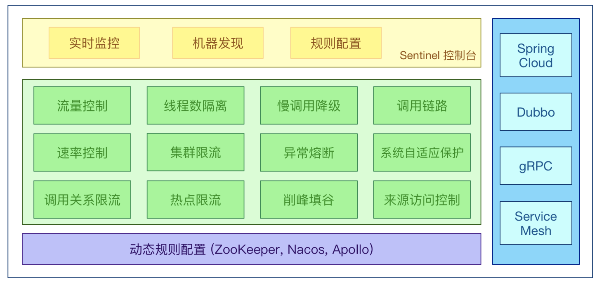


### Sentinel 基本概念

- 资源: Resource 代表微服务系统中一个url(接口) 

- 规则: Rule      包括流量控制规则、熔断降级规则以及系统保护规则。所有规则可以动态实时调整。

### sentinel使用

hystrix组件: = Hystrix组件(用来保护微服务) + hystrix dashboard 仪表盘显示  

sentinel 组件:  sentinel(保护微服务) + sentinel dashboard(显示 人性化 规则)

```markdown
- sentinel提供了两个服务组件：
	一个是 sentinel 用来实现微服务系统中服务熔断、降级等功能。这点和hystrix 类似
	一个是 sentinel dashboard 用来监控微服务系统中流量调用等情况。这点和hystrix  dashboard类似
```

#### 1. sentinel dashboard的安装

```markdown
# 1.下载
- https://github.com/alibaba/Sentinel/releases
```

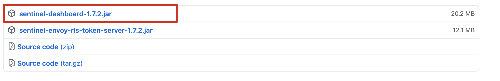

```markdown
# 2.启动
## 注意事项: 启动jar包必须配置环境变量 安装jdk8.0+
- 仪表盘是个jar包可以直接通过java命令启动 如: java -jar 方式运行 默认端口为 8080
- java -Dserver.port=9191 -jar  sentinel-dashboard-1.7.2.jar
```


```markdown
# 3.访问web界面
- http://localhost:9191/#/login
```


```markdown
# 4.登录
- 用户名&密码: sentinel
```


#### 2.sentinel 实时监控服务

```markdown
# 1.创建项目引入依赖
```

```xml
<!--引入nacos client依赖-->
<dependency>
  <groupId>com.alibaba.cloud</groupId>
  <artifactId>spring-cloud-starter-alibaba-nacos-discovery</artifactId>
</dependency>

<!--引入sentinel依赖-->
<dependency>
    <groupId>com.alibaba.cloud</groupId>
    <artifactId>spring-cloud-starter-alibaba-sentinel</artifactId>
</dependency>
```

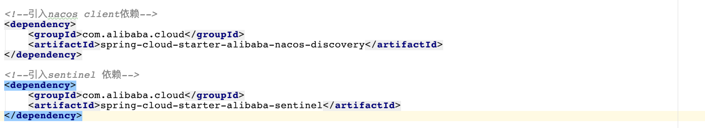

```markdown
# 2.配置
```

```properties
server.port=8789
spring.application.name=nacosclient
spring.cloud.nacos.server-addr=localhost:8848
spring.cloud.nacos.discovery.server-addr=${spring.cloud.nacos.server-addr}

spring.cloud.sentinel.enabled=true											 # 开启sentinel 默认开启
spring.cloud.sentinel.transport.dashboard=localhost:9191 # 连接dashboard
spring.cloud.sentinel.transport.port=8719								 # 与dashboard通信的端口
```

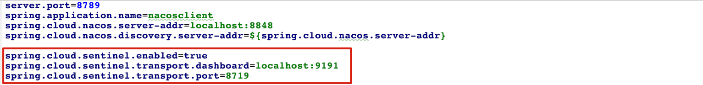

```markdown
# 3.启动服务
```

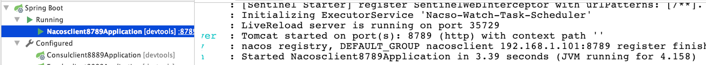

```markdown
# 4.访问dashboard界面查看服务监控
- 发现界面什么都没有? 
- 默认情况下sentiel为延迟加载,不会在启动之后立即创建服务监控,需要对服务进行调用时才会初始化
```


```markdown
# 5.开发服务
```

```java
@RestController
@Slf4j
public class SentinelController {
    @GetMapping("/sentinel/test")
    public String test(){
        log.info("sentinel test");
        return "sentinel test ";
    }

    @GetMapping("/sentinel/test1")
    public String test1(){
        log.info("sentinel test1");
        return "sentinel test1 ";
    }
}
```

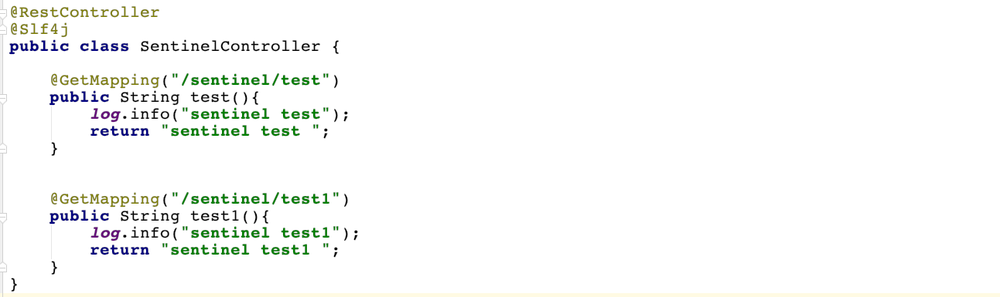

```markdown
# 6.启动进行调用
- http://localhost:8789/sentinel/test
```

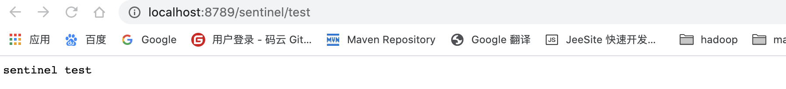

```markdown
# 7.查看监控界面
```

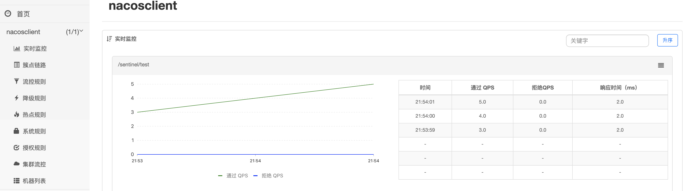

#### 3.sentinel 流量控制

```markdown
# 0.说明
- 流量控制（flow control），其原理是监控应用流量的 QPS 或并发线程数等指标，当达到指定的阈值时对流量进行控制，以避免被瞬时的流量高峰冲垮，从而保障应用的高可用性。

- 同一个资源可以创建多条限流规则。FlowSlot 会对该资源的所有限流规则依次遍历，直到有规则触发限流或者所有规则遍历完毕。

- 一条限流规则主要由下面几个因素组成，我们可以组合这些元素来实现不同的限流效果：
	resource：资源名，即限流规则的作用对象  服务路径 /test/test 
	count: 限流阈值
	grade: 限流阈值类型（QPS 或并发线程数）
	limitApp: 流控针对的调用来源，若为 default 则不区分调用来源
	
	strategy: 调用关系限流策略  直接   关联  链路
	
	controlBehavior: 流量控制效果（直接拒绝、Warm Up、匀速排队）

- 流量控制主要有两种统计类型，一种是统计并发线程数，另外一种则是统计 QPS
- 更多细节参见官网:https://github.com/alibaba/Sentinel/wiki/%E6%B5%81%E9%87%8F%E6%8E%A7%E5%88%B6
```

###### QPS限流

```markdown
# 1.配置QPS流量控制
```

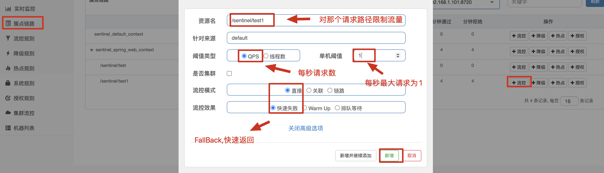

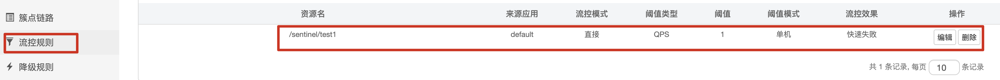

```markdown
# 2.测试
- 每秒只能最大接收1个请求,超过1个报错
```

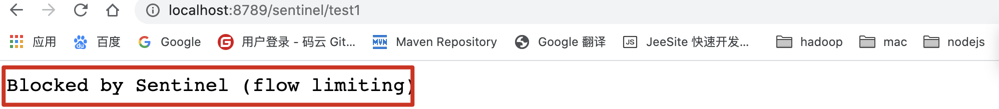

###### 线程数限流

```markdown
# 1.配置线程数限流
```

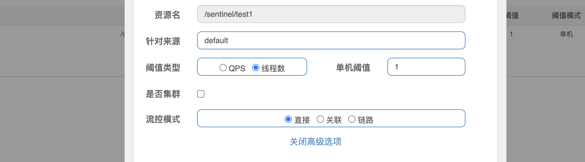

```markdown
# 2.访问测试
```

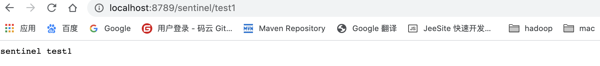

###### 流控模式

```markdown
# 1.说明
- 直接:标识流量控制规则到达阈值直接触发流量控制

- 关联: 当两个资源之间具有资源争抢或者依赖关系的时候，这两个资源便具有了关联。比如对数据库同一个字段的读操作和写操作存在争抢，读的速度过高会影响写得速度，写的速度过高会影响读的速度。如果放任读写操作争抢资源，则争抢本身带来的开销会降低整体的吞吐量。可使用关联限流来避免具有关联关系的资源之间过度的争抢，举例来说，read_db 和 write_db 这两个资源分别代表数据库读写，我们可以给 read_db 设置限流规则来达到写优先的目的：设置 strategy 为 RuleConstant.STRATEGY_RELATE 同时设置 refResource 为 write_db。这样当写库操作过于频繁时，读数据的请求会被限流。
```

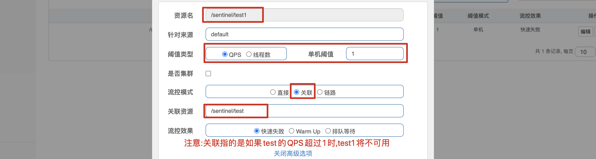

```markdown
- 链路限流: https://github.com/alibaba/Sentinel/wiki/%E6%B5%81%E9%87%8F%E6%8E%A7%E5%88%B6
```

###### 流控效果

```markdown
- 直接拒绝:（RuleConstant.CONTROL_BEHAVIOR_DEFAULT）方式是默认的流量控制方式，当QPS超过任意规则的阈值后，新的请求就会被立即拒绝，拒绝方式为抛出FlowException。

- Warm Up:（RuleConstant.CONTROL_BEHAVIOR_WARM_UP）方式，即预热/冷启动方式。当系统长期处于低水位的情况下，当流量突然增加时，直接把系统拉升到高水位可能瞬间把系统压垮。通过"冷启动"，让通过的流量缓慢增加，在一定时间内逐渐增加到阈值上限，给冷系统一个预热的时间，避免冷系统被压垮。
	更多:https://github.com/alibaba/Sentinel/wiki/%E9%99%90%E6%B5%81---%E5%86%B7%E5%90%AF%E5%8A%A8
	
	
- 匀速排队:(RuleConstant.CONTROL_BEHAVIOR_RATE_LIMITER）方式会严格控制请求通过的间隔时间，也即是让请求以均匀的速度通过，对应的是漏桶算法。 只能对请求进行排队等待
	更多:https://github.com/alibaba/Sentinel/wiki/%E6%B5%81%E9%87%8F%E6%8E%A7%E5%88%B6-%E5%8C%80%E9%80%9F%E6%8E%92%E9%98%9F%E6%A8%A1%E5%BC%8F
```

---

#### 4.熔断降级

```markdown
# 0.说明
- https://github.com/alibaba/Sentinel/wiki/%E7%86%94%E6%96%AD%E9%99%8D%E7%BA%A7
- 除了流量控制以外，对调用链路中不稳定的资源进行熔断降级也是保障高可用的重要措施之一。由于调用关系的复杂性，如果调用链路中的某个资源不稳定，最终会导致请求发生堆积。Sentinel **熔断降级**会在调用链路中某个资源出现不稳定状态时（例如调用超时或异常比例升高），对这个资源的调用进行限制，让请求快速失败，避免影响到其它的资源而导致级联错误。当资源被降级后，在接下来的降级时间窗口之内，对该资源的调用都自动熔断（默认行为是抛出 `DegradeException`）。
```

###### 降级策略

- 平均响应时间 (DEGRADE_GRADE_RT)：当 1s 内持续进入 N 个请求，对应时刻的平均响应时间（秒级）均超过阈值（count，以 ms 为单位），那么在接下的时间窗口（DegradeRule 中的 timeWindow，以 s 为单位）之内，对这个方法的调用都会自动地熔断（抛出 DegradeException）。注意 Sentinel 默认统计的 RT 上限是 4900 ms，超出此阈值的都会算作 4900 ms，若需要变更此上限可以通过启动配置项 -Dcsp.sentinel.statistic.max.rt=xxx 来配置。


- 异常比例 (DEGRADE_GRADE_EXCEPTION_RATIO)：当资源的每秒请求量 >= N（可配置），并且每秒异常总数占通过量的比值超过阈值（DegradeRule 中的 count）之后，资源进入降级状态，即在接下的时间窗口（DegradeRule 中的 timeWindow，以 s 为单位）之内，对这个方法的调用都会自动地返回。异常比率的阈值范围是 [0.0, 1.0]，代表 0% - 100%。


- 异常数 (DEGRADE_GRADE_EXCEPTION_COUNT)：当资源近 1 分钟的异常数目超过阈值之后会进行熔断。注意由于统计时间窗口是分钟级别的，若 timeWindow 小于 60s，则结束熔断状态后仍可能再进入熔断状态。


####  5.SentinelResource注解

```markdown
# 0.说明
- https://github.com/alibaba/Sentinel/wiki/%E6%B3%A8%E8%A7%A3%E6%94%AF%E6%8C%81
```

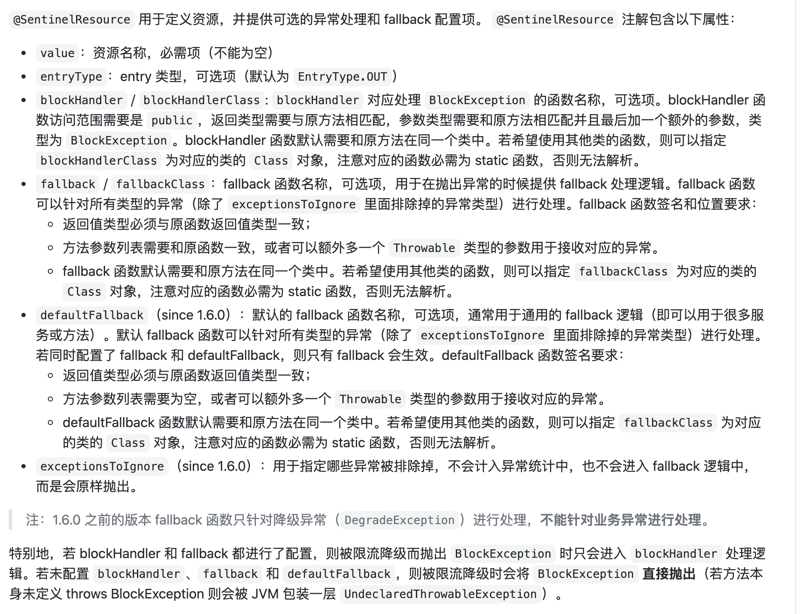

```java
 @GetMapping("/sentinel/test1")
    @SentinelResource(value = "aa",blockHandler = "fallBack",fallback = "fall")
    public String test1(int id){
        log.info("sentinel test1");
        if(id<0)		
            throw new RuntimeException("非法参数!!!");
        }
        return "sentinel test1 :"+id;
    }
		//降级异常处理
    public String fallBack(int id,BlockException e){
            if(e instanceof FlowException){
                return "当前服务已被流控! "+e.getClass().getCanonicalName();
            }
            return "当前服务已被降级处理! "+e.getClass().getCanonicalName();
    }
		//异常处理
    public String fall(int id){
        return "当前服务已不可用!";
    }
```

#### 6.授权规则

```java
@Component
public class RequestOriginParserDefinition implements RequestOriginParser {
    // 获取调用方标识信息并返回
    @Override
    public String parseOrigin(HttpServletRequest request) {
        String serviceName = request.getParameter("serviceName");
        StringBuffer url = request.getRequestURL();
        if (url.toString().endsWith("favicon.ico")) {
            // 浏览器会向后台请求favicon.ico图标
            return serviceName;
        }

        if (StringUtils.isEmpty(serviceName)) {
            throw new IllegalArgumentException("serviceName must not be null");
        }

        return serviceName;
    }
}
```

## 5.Seata 分布式事务

官网: http://seata.io/zh-cn/

>  Seata 是一款开源的分布式事务解决方案，致力于在微服务架构下提供高性能和简单易用的分布式事务服务。


#### 下载

下载地址:https://github.com/seata/seata/releases/tag/v0.8.0

```markdown
# 1.下载seta并解压缩
- bin 启动的脚本文件
- conf 配置文件
- lib 依赖目录
```


```markdown
# 2.修改conf目录下配置信息
- 修改file.conf
```

```javascript
service {
  #vgroup->rgroup #修改下面配置
  vgroup_mapping.my_test_tx_group = "fsp_tx_group"
  ....
}
```

```javascript
store {
  ## store mode: file、db  修改这里，表明事务信息用db存储
  mode = "db" 
  ....
   ## database store
  db {
    ## the implement of javax.sql.DataSource, such as DruidDataSource(druid)/BasicDataSource(dbcp) etc.
    datasource = "dbcp"
    ## mysql/oracle/h2/oceanbase etc.
    db-type = "mysql"
    driver-class-name = "com.mysql.jdbc.Driver"
    url = "jdbc:mysql://127.0.0.1:3306/seata-server"#修改这里
    user = "root"#修改这里
    password = "root"#修改这里
    min-conn = 1
    max-conn = 3
    global.table = "global_table"
    branch.table = "branch_table"
    lock-table = "lock_table"
    query-limit = 100
  }
}
```

```markdown
# 3.创建seata-server数据库
- 1.创建数据库为seata-server
- 2.在安装包的conf目录中获取 conf目录获取db_store.sql文件执行
```


```markdown
# 4.修改 conf 目录中 registry.conf 文件
```

```javascript
registry {
  # file 、nacos 、eureka、redis、zk、consul、etcd3、sofa
  type = "nacos" # 修改为nacos注册中心
  nacos {
    serverAddr = "localhost" #修改这里为nacos地址
    namespace = "public"
    cluster = "default"
  }
  .....
}
```

```markdown
# 5.启动 seta-server 服务
- ./seata-server.sh
```

----

#### 测试

```markdown
# 1.创建两个微服务进行测试
- 创建订单服务
- 创建库存服务
```


```markdown
# 2.所有项目引入如下引入依赖并注册到nacos
```

```xml
<!--springboot的web依赖-->
<dependency>
  <groupId>org.springframework.boot</groupId>
  <artifactId>spring-boot-starter-web</artifactId>
</dependency>

<!--nacos client依赖-->
<dependency>
  <groupId>com.alibaba.cloud</groupId>
  <artifactId>spring-cloud-starter-alibaba-nacos-discovery</artifactId>
</dependency>
```

```markdown
# 3.书写配置文件
- 订单服务
- 库存服务
```

```yml
server:
  port: 9091
spring:
  application:
    name: STORAGE
  cloud:
    nacos:
      server-addr: localhost:8848 #nacos server注册自己
```

```yml
server:
  port: 9090
spring:
  application:
    name: ORDERS
  cloud:
    nacos:
      server-addr: localhost:8848 #nacos server注册自己
```

```markdown
# 4.创建两个数据库执行如下sql
- 订单服务
- 库存服务
```

```sql
--- 订单sql
CREATE TABLE `orders` (
  `id` int(11) unsigned NOT NULL AUTO_INCREMENT,
  `name` varchar(255) DEFAULT NULL,
  `count` int(11) DEFAULT NULL,
  `createTime` datetime DEFAULT NULL,
  PRIMARY KEY (`id`)
) ENGINE=InnoDB AUTO_INCREMENT=10 DEFAULT CHARSET=utf8mb4;

--- 库存sql
DROP TABLE IF EXISTS `storage`;
CREATE TABLE `storage` (
  `id` int(11) unsigned NOT NULL AUTO_INCREMENT,
  `total` int(11) DEFAULT NULL,
  `use` int(11) DEFAULT NULL,
  PRIMARY KEY (`id`)
) ENGINE=InnoDB AUTO_INCREMENT=2 DEFAULT CHARSET=utf8mb4;

-- ----------------------------
-- Records of storage
-- ----------------------------
BEGIN;
	INSERT INTO `storage` VALUES (1, 100, 0);
COMMIT;
```


```markdown
# 5.在微服务中引入依赖&编写订单和库存服务配置文件
```

```xml
<!--mybatis-springboot整合依赖-->
<dependency>
  <groupId>org.mybatis.spring.boot</groupId>
  <artifactId>mybatis-spring-boot-starter</artifactId>
  <version>2.2.0</version>
</dependency>
<!--mysql驱动jar包-->
<dependency>
  <groupId>mysql</groupId>
  <artifactId>mysql-connector-java</artifactId>
  <version>5.1.38</version>
</dependency>
<!--阿里巴巴druid数据源-->
<dependency>
  <groupId>com.alibaba</groupId>
  <artifactId>druid</artifactId>
  <version>1.2.4</version>
</dependency>
```

```yaml
# 订单服务加入
spring:
  datasource:
    driver-class-name: com.mysql.jdbc.Driver
    url: jdbc:mysql://localhost:3306/orders?characterEncoding=UTF-8
    username: root
    password: root

mybatis:
  type-aliases-package: com.baizhi.entity
  mapper-locations: classpath:com/baizhi/mapper/*.xml
```

```yml
# 库存服务加入
spring:
  datasource:
    driver-class-name: com.mysql.jdbc.Driver
    url: jdbc:mysql://localhost:3306/storages
    username: root
    password: root

mybatis:
  type-aliases-package: com.baizhi.entity
  mapper-locations: classpath:com/baizhi/mapper/*.xml
```

```markdown
# 6.库存服务开发减库存接口
```

```java
//1.实体类
public class Storage {
    private Integer id;
    private Integer total;
    private Integer use;
}
```

```java
//2.Dao接口
public interface StorageDao {
    //更新库存 参数1: 库存id   参数2: 购买数量
    void decrStorage(@Param("id") Integer id,@Param("count") Integer count);
}
```

```xml
//3.mapper实现
<mapper namespace="com.baizhi.dao.StorageDao">
    <update id="decrStorage" parameterType="com.baizhi.entity.Storage">
        UPDATE `storage`
        SET `total` = `total` - #{count},
            `USE` = `USE` + #{count}
        WHERE
            id = #{id}
    </update>
</mapper>
```

```java
// 4.service接口
public interface StorageService {
    //更新库存
    void decrStorage(Integer id,Integer count) ;
}
@Service
public class StorageServiceImpl  implements StorageService{
    @Autowired
    private StorageDao storageDao;
    @Override //参数1: 更新库存id  参数2:购买的数量
    public void decrStorage(Integer id,Integer count) {
        storageDao.decrStorage(id,count);
    }
}
```

```java
//5.更新库存接口
@RestController
@RequestMapping("storages")
public class StorageController {

    @Autowired
    private StorageService storageService;

    //更新库存接口
    @GetMapping
    public void descStorage(Integer id,Integer count){
        storageService.decrStorage(id,count);
    }
}
```

```markdown
# 7.订单服务调用库存服务
```

```java
//1.实体类
public class Orders {
    private Integer id;
    private String name;
    private Integer count;
    private Date createTime;
}
```

```java
public interface OrderDao {
    //创建订单
    void insert(Orders orders);
}
```

```xml
<mapper namespace="com.baizhi.dao.OrderDao">
    <insert id="insert" parameterType="com.baizhi.entity.Orders" useGeneratedKeys="true" keyProperty="id">
        insert into orders values(#{id},#{name},#{count},#{createTime})
    </insert>
</mapper>
```

```java
@FeignClient("STORAGE")
public interface StorageApi {//通过feign接口调用库存服务
 @GetMapping("storages")
 void descStorage(@RequestParam("id") Integer id, @RequestParam("count") Integer count);

}
```

```java
public interface OrderService {
  	//创建订单接口
    void createOrder(Orders order);
}
@Service
@Transactional
public class OrderServiceImpl implements OrderService {
    @Autowired
    private OrderDao orderDao;
    @Autowired
    private StorageApi storageApi;
    @Override
    public void createOrder(Orders order) {
        order.setCreateTime(new Date());
        //创建订单
        orderDao.insert(order);
        //修改库存
        storageApi.descStorage(1,order.getCount());
    }
}

```

```java
@RestController
@RequestMapping("orders")
public class OrdersController {
    @Autowired
    private OrderService orderService;
   
    //创建订单接口
    @GetMapping
    public String createOrder(Orders orders){
        orderService.createOrder(orders);
        return "create order success";
    }
}
```

```markdown
# 8.启动并测试
```

```http
http://localhost:9090/orders?name=iphone8&count=2
```


```markdown
# 9.模拟异常
```

```java
 public void createOrder(Orders order) {
   order.setCreateTime(new Date());
   //创建订单
   orderDao.insert(order);
   //修改库存
   storageApi.descStorage(1,order.getCount());
   int n=1/0; //模拟异常
 }
```

```markdown
# 10.启动测试
- 结果发现订单服务创建成功,库存调用使用失败了! 没有回滚!
```

```markdown
# 11.订单和库存引入seta相关依赖
```

```xml
 			<dependency>
            <groupId>com.alibaba.cloud</groupId>
            <artifactId>spring-cloud-alibaba-seata</artifactId>
            <version>2.1.0.RELEASE</version>
            <exclusions>
                <exclusion>
                    <groupId>io.seata</groupId>
                    <artifactId>seata-all</artifactId>
                </exclusion>
            </exclusions>
        </dependency>

        <dependency>
            <groupId>io.seata</groupId>
            <artifactId>seata-all</artifactId>
            <version>1.1.0</version>
        </dependency>
```

```markdown
# 12.订单服务和库存服务引入file.conf配置文件
```

```markdown
transport {
  # tcp udt unix-domain-socket
  type = "TCP"
  #NIO NATIVE
  server = "NIO"
  #enable heartbeat
  heartbeat = true
  # the client batch send request enable
  enableClientBatchSendRequest = true
  #thread factory for netty
  threadFactory {
    bossThreadPrefix = "NettyBoss"
    workerThreadPrefix = "NettyServerNIOWorker"
    serverExecutorThread-prefix = "NettyServerBizHandler"
    shareBossWorker = false
    clientSelectorThreadPrefix = "NettyClientSelector"
    clientSelectorThreadSize = 1
    clientWorkerThreadPrefix = "NettyClientWorkerThread"
    # netty boss thread size,will not be used for UDT
    bossThreadSize = 1
    #auto default pin or 8
    workerThreadSize = "default"
  }
  shutdown {
    # when destroy server, wait seconds
    wait = 3
  }
  serialization = "seata"
  compressor = "none"
}
service {
  #transaction service group mapping
  vgroupMapping.fsp_tx_group = "default" #`修改事务分组和seata一致`
  #only support when registry.type=file, please don't set multiple addresses
  default.grouplist = "127.0.0.1:8091"
  #degrade, current not support
  enableDegrade = false
  #disable seata
  disableGlobalTransaction = false
}

client {
  rm {
    asyncCommitBufferLimit = 10000
    lock {
      retryInterval = 10
      retryTimes = 30
      retryPolicyBranchRollbackOnConflict = true
    }
    reportRetryCount = 5
    tableMetaCheckEnable = false
    reportSuccessEnable = false
  }
  tm {
    commitRetryCount = 5
    rollbackRetryCount = 5
  }
  undo {
    dataValidation = true
    logSerialization = "jackson"
    logTable = "undo_log"
  }
  log {
    exceptionRate = 100
  }
}
```

```markdown
registry {
  # file 、nacos 、eureka、redis、zk、consul、etcd3、sofa
  type = "nacos"

  nacos {
    serverAddr = "localhost:8848"
    namespace = ""
    cluster = "default"
  }
  eureka {
    serviceUrl = "http://localhost:8761/eureka"
    application = "default"
    weight = "1"
  }
  redis {
    serverAddr = "localhost:6379"
    db = "0"
    password = ""
    cluster = "default"
    timeout = "0"
  }
  zk {
    cluster = "default"
    serverAddr = "127.0.0.1:2181"
    session.timeout = 6000
    connect.timeout = 2000
    username = ""
    password = ""
  }
  consul {
    cluster = "default"
    serverAddr = "127.0.0.1:8500"
  }
  etcd3 {
    cluster = "default"
    serverAddr = "http://localhost:2379"
  }
  sofa {
    serverAddr = "127.0.0.1:9603"
    application = "default"
    region = "DEFAULT_ZONE"
    datacenter = "DefaultDataCenter"
    cluster = "default"
    group = "SEATA_GROUP"
    addressWaitTime = "3000"
  }
  file {
    name = "file.conf"
  }
}

config {
  # file、nacos 、apollo、zk、consul、etcd3、springCloudConfig
  type = "file"

  nacos {
    serverAddr = "localhost"
    namespace = ""
    group = "SEATA_GROUP"
  }
  consul {
    serverAddr = "127.0.0.1:8500"
  }
  apollo {
    app.id = "seata-server"
    apollo.meta = "http://192.168.1.204:8801"
    namespace = "application"
  }
  zk {
    serverAddr = "127.0.0.1:2181"
    session.timeout = 6000
    connect.timeout = 2000
    username = ""
    password = ""
  }
  etcd3 {
    serverAddr = "http://localhost:2379"
  }
  file {
    name = "file.conf"
  }
}
```

```markdown
# 13.在订单和库存库中执行unlog日志表
```

```sql
CREATE TABLE `undo_log` (
  `id` bigint(20) NOT NULL AUTO_INCREMENT,
  `branch_id` bigint(20) NOT NULL,
  `xid` varchar(100) NOT NULL,
  `context` varchar(128) NOT NULL,
  `rollback_info` longblob NOT NULL,
  `log_status` int(11) NOT NULL,
  `log_created` datetime NOT NULL,
  `log_modified` datetime NOT NULL,
  `ext` varchar(100) DEFAULT NULL,
  PRIMARY KEY (`id`),
  UNIQUE KEY `ux_undo_log` (`xid`,`branch_id`)
) ENGINE=InnoDB AUTO_INCREMENT=1 DEFAULT CHARSET=utf8;
```

```markdown
# 14.在order和storage服务中引入dataSource
```

```java
@Configuration
public class DataSourceConfiguration {

    @Bean
    @ConfigurationProperties(prefix = "spring.datasource")
    public DataSource druidDataSource(){
        DruidDataSource druidDataSource = new DruidDataSource();
        return druidDataSource;
    }

    @Primary
    @Bean("dataSource")
    public DataSourceProxy dataSource(DataSource druidDataSource){
        return new DataSourceProxy(druidDataSource);
    }

    @Bean
    public SqlSessionFactory sqlSessionFactory(DataSourceProxy dataSourceProxy)throws Exception{
        SqlSessionFactoryBean sqlSessionFactoryBean = new SqlSessionFactoryBean();
        sqlSessionFactoryBean.setDataSource(dataSourceProxy);
        sqlSessionFactoryBean.setMapperLocations(new PathMatchingResourcePatternResolver()
        .getResources("classpath*:/com/baizhi/mapper/*.xml"));
        sqlSessionFactoryBean.setTransactionFactory(new SpringManagedTransactionFactory());
        return sqlSessionFactoryBean.getObject();
    }
}
```

```markdown
# 15.在order和storage入口类中去掉数据源自动创建
```

```java
@SpringBootApplication(exclude = DataSourceAutoConfiguration.class)
@EnableDiscoveryClient
@MapperScan("com.baizhi.dao")
@EnableFeignClients
public class OrderApplication {
    public static void main(String[] args) {
        SpringApplication.run(OrderApplication.class,args);
    }
}
```

```markdown
# 16.在order和storage服务中加入事务分组
```

```yml
server:
  port: 9090
spring:
  application:
    name: ORDERS
  cloud:
    nacos:
      server-addr: localhost:8848 
    alibaba:
      seata:
        tx-service-group: fsp_tx_group #事务分组

  datasource:
    driver-class-name: com.mysql.jdbc.Driver
    url: jdbc:mysql://localhost:3306/orders?characterEncoding=UTF-8
    username: root
    password: root

mybatis:
  type-aliases-package: com.baizhi.entity
  mapper-locations: classpath:com/baizhi/mapper/*.xml

logging:
  level:
    io:
      seata: info
    com:
      baizhi:
        dao: debug
```

```markdown
# 17.在order服务中加入事务处理
```

```java
@Override
@GlobalTransactional(name="create order")
public void createOrder(Orders order) {
  order.setCreateTime(new Date());
  //创建订单
  orderDao.insert(order);
  //修改库存
  storageApi.descStorage(1,order.getCount());
  int n=1/0; //模拟异常
}
```


## 6.整合环境公共依赖

**spring boot 2.2+**

**springcloud Hoxton+**

**springcloud alibaba 2.2.1+**

```markdown
# 0.构建项目并引入依赖
```

```xml

 <!--继承springboot父项目-->
<parent>
  <groupId>org.springframework.boot</groupId>
  <artifactId>spring-boot-starter-parent</artifactId>
  <version>2.2.5.RELEASE</version>
</parent>

<properties>
  <java.version>1.8</java.version>
  <spring-cloud.version>Hoxton.SR6</spring-cloud.version>
  <spring.cloud.alibaba.version>2.2.1.RELEASE</spring.cloud.alibaba.version>
</properties>

<dependencyManagement>
  <dependencies>
    <!--引入springcloud alibaba-->
    <dependency>
      <groupId>com.alibaba.cloud</groupId>
      <artifactId>spring-cloud-alibaba-dependencies</artifactId>
      <version>${spring.cloud.alibaba.version}</version>
      <type>pom</type>
      <scope>import</scope>
    </dependency>
    <!--引入springcloud-->
    <dependency>
      <groupId>org.springframework.cloud</groupId>
      <artifactId>spring-cloud-dependencies</artifactId>
      <version>${spring-cloud.version}</version>
      <type>pom</type>
      <scope>import</scope>
    </dependency>
  </dependencies>
</dependencyManagement>
```

----

