# Vue3 实战


## Vue 简介

```markdown
# 定义:
- 渐进式 javascript 框架
- 易用:  html css javascript 
- 高效:  开发前端页面灵活 压缩之后 js 相对更小
- 灵活:  开发灵活 多样性

# 总结
	vue 是一个 javascript 框架  作用: 简化页面中 js 操作
	bootstrap 框架 是一个 css 框架  作用: 美化页面

# 后端开发人员:
	1.为什么学习 Vue ? ===> Full Stack 全栈式开发工程师  前后端分离架构
	2.为什么是 Vue ? ===> 前后端分离 基础
	3.掌握 vue 中那些内容? 
	-  vue 基础语法核心 vue 事件 声明周期 、组件、路由、脚手架开发、状态管理。

# Vue 作者
	尤雨溪  国内的
```

-----

## Vue 入门

### 下载 js文件

```markdown
# 1.访问官方网站
- https://cn.vuejs.org/     vue2.x
- https://v3.cn.vuejs.org/  vue3.x
# 2.vue js 安装
- vue 1.x ~ 3.x
- 在页面上以 CDN 包的形式导入。 注意:必须存在网络
	<script src="https://unpkg.com/vue@next"></script>
	
- 下载 JavaScript 文件并自行托管。
	<script src="..vue.js"></script>
- 使用 npm 安装它。
	npm install vue
	
- 使用官方的 CLI 脚手架。
```

### hello world

```html
<div id="app">
       {{count}}
        {{msg}}
</div>
<!--引入 vue.js 文件-->
<script src="js/vue.global.js"></script>
<script>
    //vue3.x mount:用来指定 Vue实例作用范围 
    //注意:不推荐使用 html body 推荐: div 唯一标识
    Vue.createApp({
        data(){  // 作用: 用来在 vue 实例中管理一些列数据  
                //获取数据:在 vue 实例作用范围内 都可以使用 {{变量名}}
            return {
                count:0,//定义一个自定义数据
                msg:"hello world"
            }
        }
    }).mount("#app");
</script>
```

总结:

1. mount 方法用来指定 vue 实例作用范围,在 vue 实例作用范围内都可以使用 vue 语法
2. data(){}方法用来给 vue 实例绑定一些列数据,绑定在 data 中数据可以在 vue 作用范围内通过{{变量名}}方式直接获取数据
3. {{变量名}}这种方式获取数据,可以在{{}}获取数据时书写表达式,运算符进行相关逻辑运算,调用相关方法等
4. mount 中选择器可以使用任意 css 选择器,推荐使用 id 选择器 注意:vue 不推荐使用 html body 标签直接作为作用域

---

## v-text 和 v-html

### v-text 

> v-text: 用来获取 vue 实例中data 方法里面定义数据,并将数据以文本方式渲染到标签内部

```html
<script src="js/vue.global.js"></script>
<script>
   Vue.createApp({
       data(){
           return {
               msg: "hello world"
           }
       }
   }).mount("#app");
</script>

<h1>{{msg}} 原始{{msg}}数据 {{msg}}</h1>
<h1 v-text="msg">原始数据</h1>
```

注意:

> 1. {{}}取值: 不会将标签原始数据清空  采用值插入方式渲染数据  因此 称之为 插值表达式
>
> 2. v-text 取值: 将标签内部原始数据清空 然后再渲染数据

### v-html

> 用来获取 data 中定义数据,用来将获取数据先进行 html 解析 在渲染到页面上 

```html
<script src="js/vue.global.js"></script>
<script>
   Vue.createApp({
       data(){
           return {
               msg: "hello world",
               content:"<a href='https://www.baidu.com'>百度一下</a>"
           }
       }
   }).mount("#app");
</script>

 v-text:<h1 v-text="msg">原始数据</h1>
        <h1 v-text="content"></h1>

v-html:<h1 v-html="msg">原始数据</h1>
       <h1 v-html="content"></h1>
```

注意:

> 1. v-text 直接将 data 数据渲染到页面上 不经过任何修饰 相当于 js innerText
> 2. v-html 将 data 数据包含 html 标签解析之后在进行页面渲染 相当于 js 中 innerHTML

## v-on

> 作用: 用来给页面中 html 标签绑定事件
>
> 语法: 需要给 html 哪个标签绑定事件,直接在对应标签上书写 v-on:事件名="函数名"

事件event三要素: 

- ​	事件源: 一般指页面中 html 标签
-    事件: 页面中发生特定动作 click dbclik mouseover ....
-    事件处理程序 : 函数 监听器 javascript中函数

### 基本使用

```html
<div id="app">
   <button v-on:click="test">点我给 counter+1</button>
   <button v-on:click="test()">点我给 counter+1</button>
</div>
<script src="js/vue.global.js"></script>
<script>
     Vue.createApp({
         data(){ //用来在 vue 实例中定义一系列数据  
             return {
                msg: "v-on 指令",
                 counter: 0
             }
         },
         methods:{ //用来定义一系列函数 方法
            test:function(){
                //console.log(this);//函数中 this 代表 vue 实例
                //console.log(this.counter);//函数中 this 代表 vue 实例
                //this.counter = this.counter +1;
                this.counter++;
            }
         }
     }).mount("#app");
</script>
```

总结:

> 1. 通过v-on 指令给 html 标签绑定事件,绑定事件处理函数要在 vue 实例中 methods 属性中进行声明
> 2. 在 methods 中声明函数内部获取 this 对象,this 对象代表当前 vue 实例,那么日后可以通过 this.变量名直接获取 data 中数据

### 传递参数

```html
<div id="app">
  <h1>{{msg}}</h1>
  <h1>{{counter}}</h1>
  <button v-on:dblclick="incrmentCount">双击+1</button>
  <button v-on:click="incrmentNCount(10,'xiaochen',true)">单击+N</button>
  <button v-on:click="incrmentCountObject({count:10,name:'xiaochen',age:23,price:34.5})">单击传递对象作为参数</button>
</div>

 Vue.createApp({
        data(){
            return {
                msg:"v-on 指令",
                counter:0
            }
        },
        methods:{
            /*incrmentCount:function(){
                this.counter++;
            },*/
            incrmentCount(){//函数定义简化写法
                this.counter++;
            },
            incrmentNCount(n,name,flag){
                console.log(name);
                console.log(flag);
                this.counter = this.counter+n;
            },
            incrmentCountObject(option){
                console.log(option.name);
                console.log(option.price);
                console.log(option.age);
                this.counter = option.count+this.counter;
            }

        }
}).mount("#app");
```

总结:

>  调用事件时可以直接在事件名后通过()传递对应参数,在事件定义出声明形参接收即可

### v-on 简化语法 @

```html
<!--v-on 简化写法 @-->
<button v-on:click="incrmentCounter">点击+1</button>
<button @click="incrmentCounter">绑定事件简化写法点击+1</button>
```

总结:

> 在绑定事件时除了可以使用 v-on:进行事件绑定还可以@简化事件绑定

## v-if、v-show

### v-show

>  v-show: 用来控制页面中某个元素标签是否展示

```html
 <!--v-show 指令: 用来空页面中标签是否显示的 语法: 直接在对应标签上加入 v-show 指令  注意: v-show="boolean 返回值" true 显示  false 不显示-->
<h1 v-show="isShow">{{address}}</h1>
<button @click="show">显示</button>
<button @click="hide">隐藏</button>
<button @click="reverseStatus">显示/隐藏</button>
```

```js
 Vue.createApp({
   data(){ //用来在 vue 实例中定义一系列数据
     return {
       address:"北京市昌平区",
       isShow:false,
     }
   },
   methods:{
     show(){
       this.isShow=true;
     },
     hide(){
       this.isShow=false;
     },
     reverseStatus(){
       this.isShow = !this.isShow;
     }
   }
 }).mount("#app")//指定 vue 作用范围
```

### v-if 

>  v-if: 用来控制页面中标签是否展示的

```html
<h1 v-if="isShow">if: {{address}}</h1>
<h1 v-show="isShow">show: {{address}}</h1>
<button @click="showStatus">显示隐藏</button>
```

 ```js
 Vue.createApp({
   data(){ //用来在 vue 实例中定义一系列数据
     return {
       msg: "v-if 使用",
       address:"北京市昌平区",
       isShow:false,
     }
   },
   methods:{
     showStatus(){
       this.isShow=!this.isShow;
     }
   }
 }).mount("#app")//指定 vue 作用范围
 ```

```markdown
# 1.区别:
- 1.底层实现原理不同 v-if 通过删除页面中标签用来控制标签的展示和隐藏
-                 v-show 通过 css 的 display 属性来控制页面展示和隐藏

# 使用注意事项:
- 当数据量一定时:
- 数据量大同时变化状态较快 推荐使用 v-show  
- 数据量少 变化状态又不是非常频繁推荐使用 v-if
```

---

## v-bind

### 基本使用

> v-bind: 用来绑定html 标签的属性将 html 属性交给 vue 实例进行管理,从而达到修改 vue 实例中数据,以达到动态修改标签属性的效果

```html

<button @click="logo">logo</button>
<button @click="changeImg">有范</button>
```

```js
Vue.createApp({
  data(){ //用来在 vue 实例中定义一系列数据
    return {
      msg: "v-bind 使用",
      src: "./imgs/logo.png",
      title: "我是 logo",
      showCss:true
    }
  },
  methods:{
    logo(){
      this.src='./imgs/logo.png';
      this.title="我是 logo";
      this.showCss = true;
    },
    changeImg(){
      this.src='./imgs/1.jpg';
      this.title = "我是 有范";
      this.showCss = false;
    }

  }
}).mount("#app")//指定 vue 作用范围
```

### 简化语法

> 简化语法: v-bind:属性名=""  简化 :属性名 =""

```html

```

```js
Vue.createApp({
  data(){ //用来在 vue 实例中定义一系列数据
    return {
      msg: "v-bind 使用",
      src: "./imgs/logo.png",
      title: "我是 logo",
      showCss:true
    }
  },
  methods:{....}
}).mount("#app")//指定 vue 作用范围
```

---

## v-for 指令

>  v-for: 作用就是用来遍历 vue实例中定义对象类型数据({},数组)

```html
<!--v-for 遍历 普通 数组  复杂对象数据  注意: vue 推荐将:key 属性与 v-for 连用 -->
<h3 v-for="(value,key,index) in user" :key="key">
  index:{{index+1}} key:{{key}} value:{{value}}
</h3>

<!--遍历数组-->
<h3>{{schools[0]}} - {{schools[1]}} - {{schools[2]}}</h3>
<h3 v-for="(value,index) in schools" :key="value">
  index:{{index}} value:{{value}}
</h3>

<!--遍历对象数组-->
<span  v-for="(user,index) in users" :key="user.id">
  <h1>index:{{index}} id:{{user.id}} name:{{user.name.toUpperCase()}} 
    	age:{{user.age}} sex:{{user.sex?'男':'女'}}
  </h1>
</span>
```

```js
Vue.createApp({
  data(){ //用来在 vue 实例中定义一系列数据
    return {
      msg: "v-for 使用",
      user:{
        username: "xiaochen",
        age: 28
      },
      schools:["北京大学","清华大学","加州理工大学"],
      users:[
        {id:1,name:'xiaochen',age:23,sex:true},
        {id:2,name:'小红',age:23,sex:false},
      ]
    }
  },
  methods:{}
}).mount("#app")//指定 vue 作用范围
```

**注意:**

1.不要使用对象或数组之类的非基本类型值作为 `v-for` 的 `key`。请用字符串或数值类型的值。

2.建议尽可能在使用 `v-for` 时提供 `key` attribute，除非遍历输出的 DOM 内容非常简单，或者是刻意依赖默认行为以获取性能上的提升。

----

## v-model

>  v-mode: 用来将标签 value 值绑定给 vue 实例对象中 data 数据中值一致 从而实现双向绑定机制

```html
 <!--
            v-model: 只能将标签 value 属性值绑定给 vue 实例 交给 vue 实例管理 只能作用于表单标签
            语法: 绑定哪个标签 value 属性值 直接在对应标签书写 v-model="vue 实例 data 中变量即可"
        -->
用户名:<input type="text" v-model="username"> {{username}}

<button @click="changeMsg">改变 username</button>
```

```js
 Vue.createApp({
   data(){ //用来在 vue 实例中定义一系列数据
     return {
       msg: "v-model 使用",
       username: '',
     }
   },
   methods:{
     changeMsg(){
       this.username = 'Hello Vue';
     }
   }
 }).mount("#app")//指定 vue 作用范围
```

```markdown
# 总结
- 1.使用 v-model 最能直观体现 vue 中双向绑定原理  (MVVM) 
	2.所谓 
	双向绑定: 表单数据 value 发生变化会影响 data 中数据 data 数据变化导致页面中数据变化

# 注意
- v-model 只能用来绑定标签 value 属性 因此只能使用与表单标签
```

---

## computed 计算属性

>  computed: 用来在 vue 中完成计算相关操作

**注意:**

1. 如果日后展示数据需要经过二次处理之后才能显示到页面推荐使用 computed 完成

**好处:**

1. 多次使用 computed 计算结果时 computed 只计算一次
2. 计算结果还可以在内存中进行缓存

```js
<script>
    Vue.createApp({
        data(){},//用来在 vue 实例中定义一系列数据
        methods:{},//用来在 vue 实例中定义一些列函数       
        computed:{  //用来在 vue 实例中定义一系列计算相关操作
          totalPrice(){
            //this 代表 vue 实例
          }
        }
    }).mount("#app");
</script>
```

```html
<!--使用 computed 注意: 使用计算属性只需要用到函数名称即可-->
使用语法:  {{ computed 定义函数名称 }}
```

---

## watch 监视属性

> watch: 用来在 vue 中完成 vue 实例中属性 监视 监控

### 基本监控

```html
<div id="app">
  <h1>{{msg}}</h1>
  <h1>{{counter}}</h1>
  <button @click="increment">counter+1</button>
</div>
```

```js
Vue.createApp({
  data(){ //用来在 vue 实例中绑定一系列数据
    return {
      msg: "watch 监听 监控 属性",
      counter:0,
    }
  },
  methods:{
    increment(){
      this.counter++;
    }
  },
  watch:{  //监听 监控属性  作用: 用来监控 vue 实例中数据改变
    counter:{
      immediate:true, //默认值:false  是否立即监控 在页面首次初始化过程中也会执行一次 watch 操作
      //参数1: 变化之后的值  参数 2: 变化之前值
      handler(newValue,oldValue){  //当前 监控 counter 发生变化时 会自动执行 handler 方法的内容
        console.log("counter被修改了",newValue,oldValue);
      }
    }
  }
}).mount("#app");
```

`注意: `

- watch 用来对 vue 中声明的属性进行监控,监控属性必须是 vue 实例中定义属性
- immediate 默认是false 代表首次初始化页面不执行监控, 设置为 true 可以初始化时触发监控操作

### 深度监控

```html
<div id="app">
  <h1>{{msg}}</h1>
  <h1>{{counter}}</h1>
  <button @click="increment">counter+1</button>
  <hr>
  <h1>{{user.name}} - {{user.age}}</h1>
  <button @click="user.age++">修改年龄</button>
</div>
```

```js
 Vue.createApp({
   data(){ //用来在 vue 实例中绑定一系列数据
     return {
       msg: "watch 监听 监控 属性",
       counter:0,
       user:{ name:"xiaochen",age:12}
     }
   },
   methods:{
     increment(){
       this.counter++;
     }
   },
   watch:{  //监听 监控属性  作用: 用来监控 vue 实例中数据改变
     counter:{
       immediate:true, //默认值:false  是否立即监控 在页面首次初始化过程中也会执行一次 watch 操作
       //参数1: 变化之后的值  参数 2: 变化之前值
       handler(newValue,oldValue){  //当前 监控 counter 发生变化时 会自动执行 handler 方法的内容
         console.log("counter被修改了",newValue,oldValue);
       }
     },
     user:{
       deep:true,//深度监听 监控 当对象中任何一个属性发生变化都会出发 handler 方法执行 //注意: 一旦启用深度监听handler 中无法获取对象原始信息
       handler(newValue,oldValue){
         console.log(newValue,oldValue)
       }
     },
   }
 }).mount("#app");
```

`注意:`

- 一旦监听对象使用深度监听在处理函数中将无法获取原始对象,只能获取改变之后对象
- 一旦开启对象深度监听,对象中任何一个属性值发生变化都会出发对应 handler 函数

### 简化语法

```javascript
//完整语法
counter:{
  	immediate:true, 
    //默认值:false  是否立即监控 在页面首次初始化过程中也会执行一次 watch 操作
    //参数1: 变化之后的值  参数 2: 变化之前值
    handler(newValue,oldValue){  
    //当前 监控 counter 发生变化时 会自动执行 handler 方法的内容
    console.log("counter被修改了",newValue,oldValue);
  }
},
//简化语法
watch:{  //监听 监控属性  作用: 用来监控 vue 实例中数据改变
  counter(newValue,oldValue){
    console.log("counter修改了",newValue,oldValue);
  },
}
```

### 总结

> computed 计算属性 和 watch 监听(监控)属性 在某种业务场景下都能完成相同效果但是需要注意的是: computed 计算属性中不能将异步结果进行返回 watch 中可以实现异步结果返回

## 事件修饰符

> 作用: 用来 vue 中事件连用,用来决定事件出发条件或决定事件触发机制

```markdown
# 1.常见事件修饰符
- .stop    用来停止事件继续执行
- .prevent 用来阻止事件的默认行为
- .self    用来指定事件独自执行
- .once    用来修饰事件执行一次
```

### stop

> 用来阻止事件冒泡

```html
<div @click="divClick" style="background: red;width: 200px; height: 200px">
  <!--.stop 用来通知事件执行完成之后不在进行事件冒泡-->
  <button @click.stop="btnClick">按钮</button>
</div>
```

```js
Vue.createApp({
  data(){ //用来在 vue 实例中绑定一系列数据
    return {
      msg: "事件修饰符",
    }
  },
  methods:{
    btnClick(){
      alert('按钮单击被触发了');
    },
    divClick(){
      alert('div 单击被触发了');
    }
  }
}).mount("#app");
```

### prevent

> 用来阻止标签的默认行为

```html
<!--.prevent 用来阻止标签默认行为-->
<a href="https://www.baidu.com" @click.prevent="aclick">百度一下</a>
```

### self 

> 用来只监听自身标签发生事件(注意: 不会执行事件冒泡的事件)

```html
<!--.self 之监听自身标签触发事件-->
<div @click.self="divClick" style="background: red;width: 200px; height: 200px">
</div>
```

### once

> 用来配置当前事件只触发一次

```html
<!--.once 事件仅仅触发一次-->
<button @click.once="btnClick">按钮2</button>
```

## 按键修饰符

> 用来与键盘的按键事件绑定在一起,用来对键盘上特定按键进行修饰

```markdown
# 常见按键修饰符
- .enter 回车键
- .tab   切换键
- .delete 删除键
- .esc    esc 键
- .space  空格键
- .up .down .left .right (上下左右)
```

### enter

> 用来在触发回车按键之后在触发改事件

```html
<!--.enter 回车-->
<input type="text" @keyup.enter="test">
```

### other

```html
<input type="text" @keyup.enter.left.up.down.right.esc.space="test">
```

`注意: 事件修饰符可以连用 多个修饰符之间直接.方式使用`

## Axios 

### 简介

官方定义:  Axios 是一个基于 promise 的 HTTP 库，可以用在浏览器和 node.js 中。

通俗定义:  Axios 异步请求库 是对 js 中 ajax 代码封装  作用: 用来在 vue 中发送一个异步请求到后端代码,并且将请求结果进行获取并渲染。

地址: http://www.axios-js.com/zh-cn/docs/

### 使用

```js
//1.使用包管理工具方式安装
npm install axios
//2.使用 CDN 安装
<script src="https://unpkg.com/axios/dist/axios.min.js"></script>
//3.本地安装
<script src="js/axios.min.js"></script>
```

### GET 方式请求

```js
//1.发送 get 方式请求 参数: QueryString ?传递参数    路径方式传递参数
axios.get('http://localhost:8080/demos/zhangsan/23').then(function (response) {
  console.log(response.data);//请求成功之后响应结果
}).catch(function (err){
  console.log("error",err);//请求出错错误处理
});
```

### POST 方式请求

```java
//参数 1: 请求路径  参数 2: 请求参数 //{"name":"xxx","age":12}
axios.post('http://localhost:8080/demos',{name:"小陈",age:23}).then(function(response){
  console.log(response.data);
}).catch(function (err) {
  console.log(err);
})
```

`注意:`

- axios 在发送 post、put、patch 请求时传递参数都是 json 格式传递参数，因此后端接口必须使用 @RequestBody 注解进行接收

### PUT、PTACH、DELETE等

```javascript
//为方便起见，为所有支持的请求方法提供了别名
axios.request(config)
axios.get(url[, config])
axios.delete(url[, config])
axios.head(url[, config])
axios.options(url[, config])
axios.post(url[, data[, config]])
axios.put(url[, data[, config]])
axios.patch(url[, data[, config]])
```

### 请求配置

更多配置参考: http://www.axios-js.com/zh-cn/docs/#axios-patch-url-data-config

```js
 //0.创建一个 axios 默认配置实例
var instance = axios.create({
  baseURL: 'http://localhost:8080', //提取公共 url
  timeout: 5000, //指定 0 代表永不超时  单位毫秒  这里是 5s内得到响应,否则立即中断
});
//1.基于创建实例发送请求
// instance.get(....);
// instance.post(....);
```

### 拦截器 Interceptor

>  在请求或响应被 `then` 或 `catch` 处理前拦截它们。

- 请求拦截器: 用来在发送请求到后端接口之前可以对请求进行一些额外处理
- 响应拦截器: 用来请求响应回来到 then、catch 之前进入响应拦截器进行响应额外处理

#### 请求拦截器

```js
//使用请求拦截器传递公共参数 header 对当前请求进行额外处理
//config 参数 axios 配置对象
instance.interceptors.request.use(function(config){
  console.log("进入请求拦截器",config);
  config.headers= {'X-Token':'123'};
  return config;//放行请求
});
```

`注意: 请求拦截器函数中 config 参数就是 axios 配置对象,必须进行 return 之后才能放心请求继续执行`

#### 响应拦截器

```js
//使用响应拦截器  参数 1: 后端响应 response 结果
instance.interceptors.response.use(function(response){
  //对象响应进行额外处理
  console.log("拦截器中获取响应数据: "+response.data);
  return response;//放行响应进入 then  catch
});
```

---

## 生命周期

> vue 生命周期: 在页面中创建一个 Vue 实例到这个实例销毁整个过程称之为Vue生命周期

### 使用

```js
var app = Vue.createApp({
  data(){
    return {
      msg: 'vue 实例生命周期'
    }
  },
  methods:{},//用来定义一系列方法
  computed:{},//用来定义一系列计算属性
  watch:{},//用来定义一系列监听属性
  //生命周期:初始化阶段
  beforeCreate(){ //仅仅内部事件 生命周期函数注入
    console.log("beforeCreate: ",this.msg);
  },
  created(){     //数据 方法 等注入  data methods computed ...
    console.log("created: ",this.msg);
  },
  beforeMount(){ //将 mount 指向 html 编译为模板 此时模板中是 null
    console.log("beforeMount: ",document.getElementById("sp"));
  },
  mounted(){     //创建虚拟 dom 并完成赋值 替换原始模板
    console.log("beforeMount: ",document.getElementById("sp").innerText);
  },
  //运行阶段
  beforeUpdate(){
    console.log("beforeUpdate: "+this.msg);
    console.log("beforeUpdate: ",document.getElementById("sp").innerText);
  },
  updated(){
    console.log("updated: "+this.msg);
    console.log("updated: ",document.getElementById("sp").innerText);
  },
  //销毁阶段
  beforeUnmount(){
    console.log("beforeUnmount: ");
  },
  unmounted(){
    console.log("unmounted:");
  }

}).mount("#app");
```

### 说明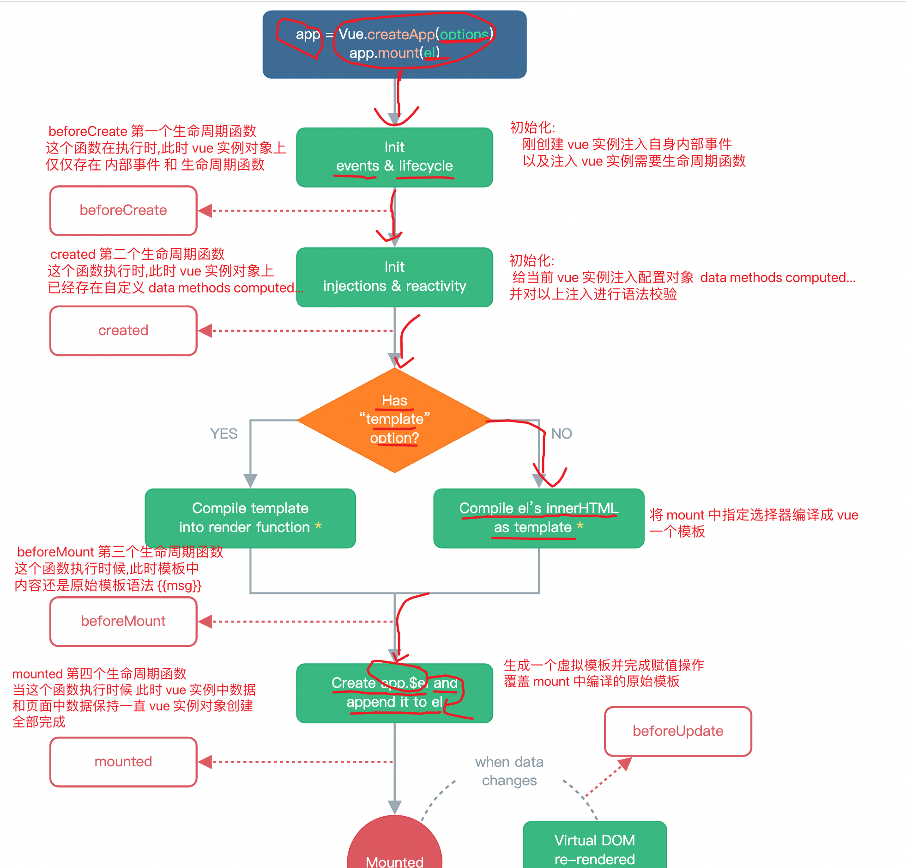

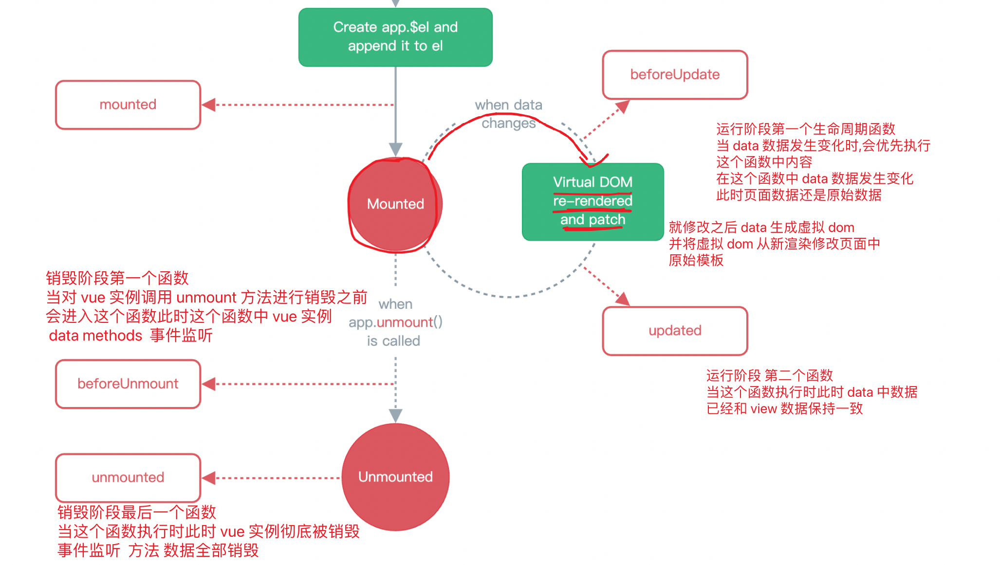

----

## ES6 语法

### 说明

EMCAScript 6 指的就是咱们平时使用 javascript 6 简称 ES6。 EMCAScript是一种由[欧洲计算机制造商协会](https://baike.baidu.com/item/欧洲计算机制造商协会)（[EMCA](https://baike.baidu.com/item/EMCA)）通过EMCA-262标准化的[脚本](https://baike.baidu.com/item/脚本)[程序设计语言](https://baike.baidu.com/item/程序设计语言)。 

ES6 主要是为了解决 ES5 的先天不足，比如 JavaScript 里并没有类的概念，但是目前浏览器的 JavaScript 是 ES5 版本，大多数高版本的浏览器也支持 ES6，不过只实现了 ES6 的部分特性和功能。

jscript   script 网景 ====> javascript chrome 欧鹏  uc  ... 到今天为止 js 依旧浏览器差异

- 1997 年 ECMAScript 1.0 诞生。
- 1998 年 6 月 ECMAScript 2.0 诞生，包含一些小的更改，用于同步独立的 ISO 国际标准。
- 1999 年 12 月 ECMAScript 3.0诞生，它是一个巨大的成功，在业界得到了广泛的支持，它奠定了 JS 的基本语法，被其后版本完全继承。直到今天，我们一开始学习 JS ，其实就是在学 3.0 版的语法。
- 2000 年的 ECMAScript 4.0 是当下 ES6 的前身，但由于这个版本太过激烈，对 ES 3 做了彻底升级，所以暂时被"和谐"了。
- 2009 年 12 月，ECMAScript 5.0 版正式发布。ECMA 专家组预计 ECMAScript 的第五个版本会在 2013 年中期到 2018 年作为主流的开发标准。2011年6月，ES 5.1 版发布，并且成为 ISO 国际标准。
- 2013 年，ES6 草案冻结，不再添加新的功能，新的功能将被放到 ES7 中；2015年6月， ES6 正式通过，成为国际标准。

### 新特性

#### 变量声明

- var 关键字声明变量
  - 声明变量为全局变量
  - 存在作用域混淆问题
- let 声明变量
  - let 一般用来声明基本类型变量,声明变量从定义开始到定义对应代码块结束
- const 声明变量
  - const 一般用来声明常量 对象类型 数组。

```js
for (let i = 0; i < 10; i++) {
  console.log(i);
}
//定义常量
const NAME='xiaochen';
console.log(NAME);
//const 对象
const user = {id:1,name:'小陈'};
console.log(user);
user.name = '小三';
console.log(user);
//const 数组
const schools = ["北京","上海","深圳"];
console.log(schools);
schools.push("南京");
console.log(schools);
```

> `注意:修饰对象允许修改对象属性值 不能修改地址`

### 模板字符串

`利用反引号``实现 html 标签友好拼接 使用模板字符串配合${}获取对应变量值`

```js
let html = "<div>" +
    "<h1>标题</h1>" +
    "<input type='text' onclick=\"test(23,"+name+")\">" +
    "<button></button>" +
    "</div>";
console.log(html);

let html1 = `<div>
                     <h1>标题</h1>
                     <input type="text" onclick="test(23,${name})">
                     <button>按钮</button>
                 </div>`;
console.log(html1);
```

### 箭头函数

新增用来定义函数新的方式,用来简化传统函数定义,这个新的函数定义方式称之为箭头函数

语法: ()=>{}

- 当参数只有一个时候()可以不写
- 当函数体中只有一行代码的时候{}可以不写
- 箭头函数函数内部没有自己 this 函数 this 始终是外部 this

```js
//传统函数 注意: 函数内部存在自己 this 指向
let test = function(){
  console.log(this);
  console.log("test");
}
test();
//箭头函数 注意: 箭头函数中没有自己 this
let test1 = (id,name)=>{
  console.log(id);
  console.log(name);
  console.log("test1")
}
test1(23,'小陈');
```

### 解构赋值

```js
//4.对象的解构赋值
let id=1;
let name='小陈';
let age=23;
const student = {id:id,name:name,age:age};
console.log(student);

const student1 ={id,name,age};
console.log(student1);

const fun = ({name,age})=>{
  console.log(name);
  console.log(age);
}
fun(student1);
```

## 组件<Component>

### 标准开发之SPA

SPA( Single Page [web] Application ) 单页面应用。所谓单页面应用指的是在使用 vue 开发系统中无论系统功能如何复杂，最终都要保证在整个系统中只有一张页面，这样应用|系统称之为单页面应用。

### 组件(Component)

作用: 一个组件用来完成一个或一组相关联业务逻辑集合 日后可以根据项目中不同业务划分为多个不同组件。日后在 vue 开发过程中一切皆组件。

- 全局组件
  - 直接注册到 vue 实例上,可以在任意组件中进行使用
- 局部组件
  - 注册到某个组件内部,直接在注册组件中内使用

### 组件使用

**全局组件的注册**

```js

//1.全局组件注册
app.component('counter',{
  template:`<div><h4>我是全局组件</h4></div>`, //template 属性: 用来书写组件 html 标签
});//参数 1: 组件名称 参数 2:组件配置对象

<!--2.使用组件 使用组件: 直接通过组件名称使用-->
<counter></counter>
```

**局部组件的注册**

```js
//1.局部组件注册
var app = Vue.createApp({
  data(){
    return {
      msg: 'vue 组件使用',
    }
  },
  components:{
    hello:{
      template:`<div>....</div>`
    }
  }//用来在当前组件中定义一些列局部组件
});

<!--2.使用组件 使用组件: 直接通过组件名称使用-->
<hello></hello>
```

### 组件中定义数据....等

`注意: 每一个 vue 组件都与 vue 实例是一样的可以定义 data methods computed watch components 等相关特性`

```js
 app.component('counter',{
   template:`<div><h3>我是 counter {{counter}} {{getCounter}} </h3><button @click="increment">++</button></div>`, //template 属性: 用来书写组件 html 标签,
   data(){//用来在组件内部定义属于组件自己数据
     return {
       counter:0,
     }
   },
   methods:{
     increment(){
       this.counter++;
     }
   },
   computed:{
     getCounter(){
       return this.counter*this.counter;
     }
   },
   watch:{
     counter(val){
       console.log("watch",val);
     }
   },
   //定义生命周期  初始化阶段  运行阶段  销毁阶段
   beforeCreate() {
     console.log("beforeCreate: ",this.counter);
   },
   created(){
     console.log("created: ",this.counter);
   }
 });//参数 1: 组件名称 参数 2:组件配置对象
```

### 组件之间数据传递

- 父组件向子组件传递数据

  - 语法: 使用 vue 提供 props 数组进行实现

  - 使用:

    ```html
    <!--使用自定义 hello 组件-->
    <hello :name="name" :age="age"></hello>
    ```

    ```js
    app.component('hello',{
      template:'<div><span>{{name}}  {{age}} </span></div>',
      props: ['name','age']
    });
    ```

    > `注意: 一旦通过 props 接收数据相当于组件data 中定义数据,因此可以直接使用{{}}进行获取,并且不推荐在组件 data 中定义同名属性`

- 子组件向父组件传递数据

  - vue 中没有直接提供组件向父组件传递数据语法,需要借助事件进行数据传递

  - 使用:

    ```html
    <hello :name="name" @bbb="parent"></hello>
    ```

    ```js
    var app = Vue.createApp({
      data(){
        return {
          msg: 'vue 子组件向父组件传递数据',
          name:"小明"
        }
      },
      methods:{ //在父组件上定义一些列方法
        parent(title){
          console.log("parent method ....", title);
          this.msg = title;
        }
      },
      components:{ //注册局部组件
        hello:{
          template: `<div><h2>hello 子组件  {{name}}  {{title}}</h2> <button @click="test()">click me!</button></div>`,
          data(){
            return {
              title: "child data"
            }
          },
          props: ['name'], //用来接收父组件传递数据
          emits: ['bbb'],//用来接收父组件给子组件传递事件 这个可以省略不写
          methods:{
            test(){
              console.log("test method ....");
              //调用父组件中传递的事件
              this.$emit('bbb',this.title);//参数 1: 父组件传递事件名 参数 2~~~N: 用来在调用事件传递参数
            }
          }
        }
      }
    });
    app.mount("#app");
    ```

### 插槽(slot)

#### 	基本使用

-  用来完成对组件灵活扩展

-  基本使用

  ```html
  <hello>
    <!--slot 中值-->
    <span>品牌</span>
  </hello>
  ```

  ```js
  var app = Vue.createApp({
    data(){
      return {
        msg: 'vue 中插槽的使用 slot',
      }
    },
    components:{ //注册局部组件
      hello:{
        template:`<div><slot></slot><h2>百知教育</h2><slot></slot></div>`
      }
    }
  }).mount("#app");
  ```

  #### 命名插槽

  `注意: v-slot:名称只能用于 template 标签 简化写法可以直接使用#名称代替`

  ```html
   <!--使用组件-->
  <hello>
    <!--使用 v-slot:名称 具体赋值 简化写法:  #名称-->
    <template v-slot:aa>
      <span>品牌</span>
    </template>
    <template #bb>
      <span>是一家培训机构</span>
    </template>
  </hello>
  ```

  ```js
  var app = Vue.createApp({
    data(){
      return {
        msg: 'vue 中插槽的使用 slot',
      }
    },
    components:{ //注册局部组件
      hello:{
        template:`<div><slot name="aa"></slot><h2>百知教育</h2><slot name="bb"></slot></div>`
      }
    }
  }).mount("#app");
  ```

  #### 作用域插槽

  ​	有时让插槽内容能够访问子组件中才有的数据是很有用的。

  ```html
  <!--使用组件-->
  <baizhi-schools>
    <template v-slot:aa="slotScope">
      <span style="background: red;">{{slotScope.item}}</span>
    </template>
  </baizhi-schools>
  ```

  ```js
  var app = Vue.createApp({
    data(){
      return {
        msg: 'vue 作用域插槽',
      }
    },
    components:{
      baizhiSchools:{
        template:`<div>
                  <ul>
                   <li v-for="(school,index) in schools" :key="index">
                     <!-- 通过 slot 传递组件数据 -->
                     <slot name="aa" :item="school" :index="index"></slot>
                   </li>
                  </ul>
                  </div>`,
        data(){
          return {
            schools:['北京校区','天津校区','河南校区','无锡校区','西安校区']
          }
        }
      }
    }
  }).mount("#app");
  ```

  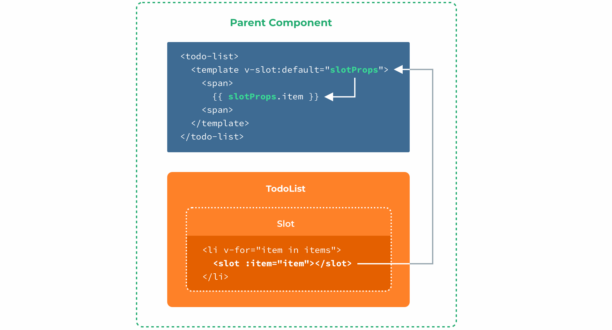

  

## 路由<Router>	

### 说明

​	官方定义: Vue Router 是 [Vue.js](http://v3.vuejs.org/) 的官方路由。它与 Vue.js 核心深度集成，让用 Vue.js 构建单页应用变得轻而易举。

​	通俗定义: 根据请求的路径按照一定的路由规则进行请求的转发从而帮我我们实现请求统一管理。

### 作用

​	用来在 vue 中按照指定路由规则来实现组件动态切换

### 使用

- 下载 vue-router : https://unpkg.com/vue-router@4

- 引入 vue-router:  

  - ```js
    <script src="js/vue.global.js"></script>
    <script src="js/vue-router.global.js"></script>
    ```

-  使用 vue-router:

  - ```js
    //1.创建一个路由对象
    const router = VueRouter.createRouter({/*定义路由规则 options */});
    //2.配置 vue 实例使用路由对象
    app.use(router);
    ```

- 定义路由规则 

  - ```js
    {
      history: VueRouter.createWebHashHistory(),//用来配置路由使用模式
        routes:[
          {path:'/login',component:login},
          {path:'/register',component: register}
        ] //用来定义路由规则 路由对象: path 路由路径   component: 用来指定这个路径对应显示组件
    }
    ```

- 展示路由组件

  - ```html
    <router-view></router-view>
    ```

### 切换路由

- 链接切换路由 <a>

  - ```html
    <a href="#/login">登录</a>
    <a href="#/register">注册</a> 
    ```

- vue 官方提供切换路由组件 <router-link>

  - ```html
    <router-link to="/login">登录</router-link> |
    <router-link to="/register">注册</router-link>
    ```

### 默认路由

```json
{path:'/',redirect:'/login'},//默认路由
```

`注意: redirect属性代表路由重定向,即访问 path 对应规则会自动重定向到 rdirect 指定路径。`

###  404 路由

```json
{path: '/:pathMatch(.*)*',component: NotFound }
```

`注意:404路由,建议最好放到所有路由规则之后`

### 命名路由<推荐>

命名路由: 就是给每一个路由对象起一个名字

```json
{path:'/login',name:'Login',component:login},
```

`注意:通过路由对象 name 属性为路由指定名称`

​	使用场景

```html
<router-link :to="{name:'Login'}">登录</router-link>
```

`注意: 一旦给路由对象定义名称,切换路由时还可以使用名称切换路由`

### 编程方式切换路由

```js
this.$router.push('/login');//path
this.$router.push({name:'Login'});//name  推荐使用名称方式切换路由
```

### 路由传递参数

- QueryString 方式传递参数

  - ```html
    <router-link to="/login?id=21&name=xiaochen">登录</router-link> 或
    <router-link :to="{name:'Login',query:{id:21,name:'小陈'}}">登录</router-link>
    ```

  - ```js
    this.$route.query;
    this.$route.query.id
    this.$route.query.name
    ```

    `注意:this.$route代表当前路由对象,使用 queryString 方式传递参数可以使用$route.query 方式获取`

- PathVariable<路径>方式传递参数

  - ```html
    <router-link to="/register/32/xiaohei/true">注册</router-link> 或
    <router-link :to="{name:'Register',params:{id:22,name:'小黑',sex:true}}">注册</router-link>
    ```

  - ```json
    {path:'/register/:id/:name/:sex',name:'Register',component:register},
    ```

  - ```js
    this.$route.params.id
    this.$route.params.name
    this.$route.params.sex
    ```

    `注意:在路径中传递参数日后可以使用$route.params 进行获取`

### 嵌套路由

说明: 嵌套路由就是在一个路由组件中还要划分多个不同的其他子路由过程称之为嵌套路由

- 定义组件多个

  ```js
  //定义用户组件
  const users = {
          template: `<div>
                  <h2>用户管理</h2>
                  <!--用来配置子路由展示位置-->
                  <router-view></router-view>
                  <router-link :to="{name:'Profile'}">用户信息</router-link>
                  <router-link :to="{name:'Posts'}">用户地址</router-link>
            </div>`
  };
  //个人中心
  const profile = {
    template: `<div>
                 <ul>
                    <li>{{user.name}}</li>
                    <li>{{user.age}}</li>
                    <li>{{user.sex?'男':'女'}}</li>
                 </ul>
                </div>`,
  };
  //收货地址
  const posts = {
    template:`<div>
                  <ul>
                    <li v-for="addr in address">{{addr}}</li>
                  </ul>
              </div>`,
  };
  ```

- 定义路由

  ```js
  //1.创建路由
  const router = VueRouter.createRouter({
    history: VueRouter.createWebHashHistory(), //1.hash # 2.history
    routes:[//路由规则
      {
        path:'/users',
        name:'Users',
        component:users,
        children:[//用来配置嵌套路由  注意:孩子路由在定义路径时不能使用 "/" 开头
          {path:'profile',name:'Profile',component: profile},
          {path:'posts',name:'Posts',component: posts},
        ],
      },
    ]
  });
  ```

  `注意:子路由通过 children 属性进行定义,子路由的 path 定义不能使用/开头`。

- 子路由使用要在对应组件内部使用

  ```html
  <router-view/>
  ```

### 路由模式

- 说明

  - 在 vue router 中提供两种路由模式,一种模式为 hash、html(history)模式

- hash 模式

  - ```js
    const router = createRouter({
      history: VueRouter.createWebHashHistory(),
      routes: [
        //...
      ],
    })
    ```

    它在内部传递的实际 URL 之前使用了一个哈希字符（`#`）。由于这部分 URL 从未被发送到服务器，所以它不需要在服务器层面上进行任何特殊处理。不过，**它在 SEO 中确实有不好的影响**。如果你担心这个问题，可以使用 HTML5 模式。

- html 模式

  - ```js
    const router = createRouter({
      history: VueRouter.createWebHistory(),
      routes: [
        //...
      ],
    })
    ```

    当使用这种历史模式时，URL 会看起来很 "正常"，例如 `https://example.com/user/id`。漂亮!

    - `注意:这种方式需要在部署页面时在服务上进行额外处理`

## Vue Cli

https://cli.vuejs.org/zh/

### 说明

Vue Cli 又称为`Vue 中脚手架` 

官方定义:  **Vue.js 开发的标准工具**

通俗定义:  Vue cli  称之为 `Vue 中脚手架` 提供 vue 开发一套标准项目结构(规范),可以让 vue 开发变得更加灵活、解耦合、标准规范。

### 特性

- 提供一套标准项目结构，基于标准结构开发可以使 vue 开发更加规范
- 使用 nodejs 作为项目服务器运行，集成了 npm 包管理工具，让项目测试和开发更灵活
- 自动将 es6 语法在打包时自动转为 es5 以便兼容所有浏览器运行

### 安装NodeJS

http://nodejs.cn/download/current/

```markdown
# 1.下载 nodejs
- http://nodejs.cn/download/current/

# 2.解压缩 nodejs 到指定位置
- E:\\nodejs

# 3.配置环境变量
- 系统环境变量---->添加如下配置:
- PATH=E:\\nodejs

# 4.打开 cmd 窗口
- node -v
```

### 配置NPM镜像加速

```markdown
# 1.npm 最新淘宝镜像地址
- https://registry.npmmirror.com

# 2.配置 npm 镜像地址
- npm config set registry https://registry.npmmirror.com

# 3.查看 npm 配置信息
- npm config ls
```

### 安装 Vue Cli

```markdown
# 1.安装 vue cli
- npm install -g @vue/cli

# 2.测试 vue cli
- vue -V
```

### helloworld

```markdown
# 1.创建项目
- vue create 项目名称
```

```markdown
# 2.手动创建项目
```

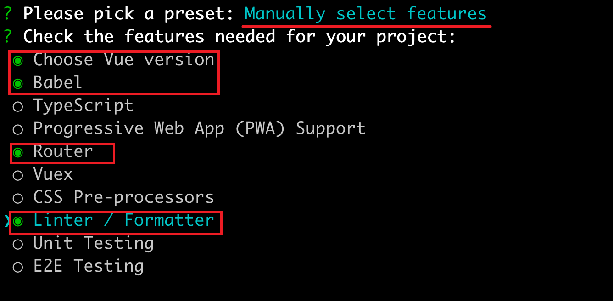

```markdown
# 3.选择 vue版本
```

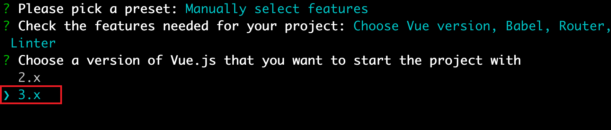

```markdown
# 4.选择路由使用模式
```

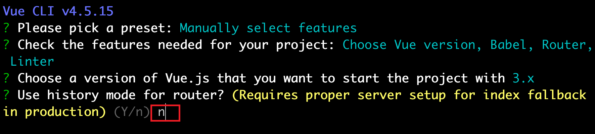

```markdown
# 5.选择使用的格式化方式
```

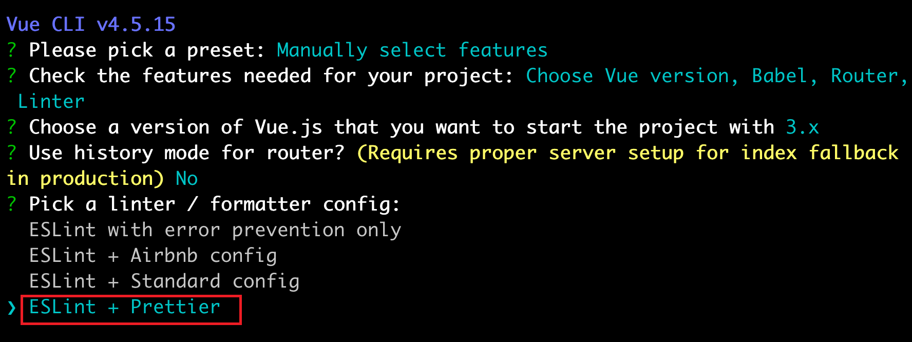

```markdown
# 6.选择格式化方式
```

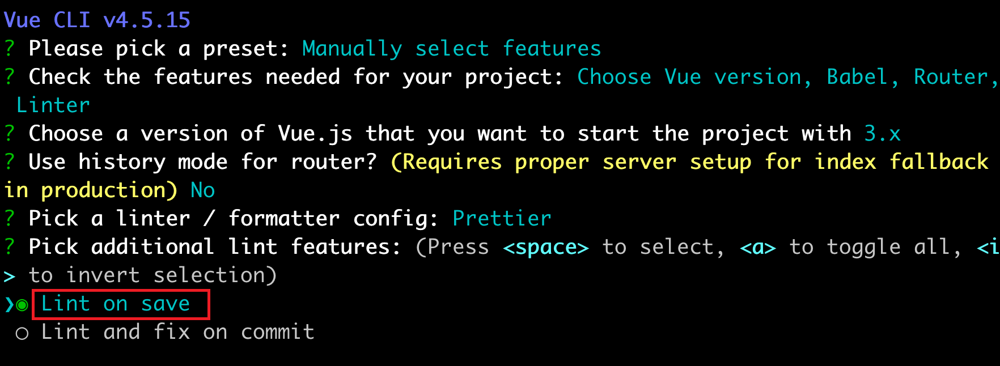

```markdown
# 7.划分配置文件的方式
```

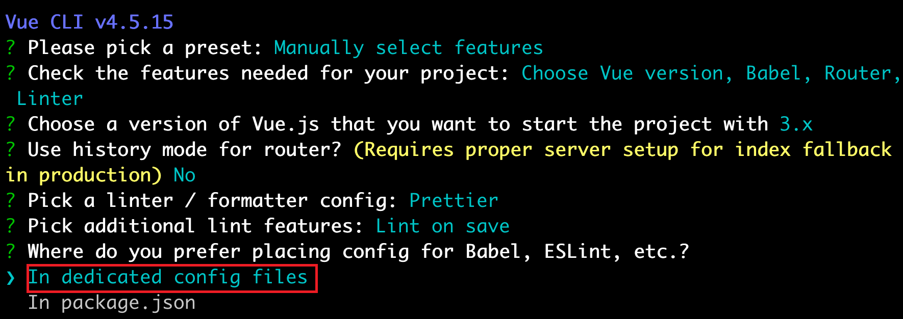

```markdown
# 8.运行脚手架创建的项目
- cd 进入项目根目录
- npm run serve
```

### 项目结构

```markdown
# 1.完整项目结构
```

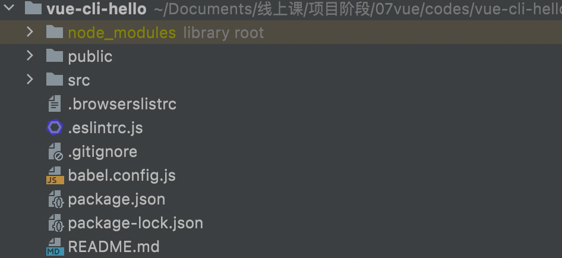

- node_modules:  用来存储当前项目需要用到依赖
-  package.json  :  用来描述当前项目中使用依赖以及版本相当于maven项目中pom.xml文件

- public              :  `用来存放项目唯一页面index.html、以及对应 favoicon 图标`
- src                   :  `用来存放日后开发的所有组件以及 js 文件等。`
- .browserslistrc:  用来配置浏览器相关特性
- .eslintrc.js       :  用来配置esLint 相关配置
- babel.config.js:  用来配置将 es6语法在打包过程中转为 es5 语法配置

```markdown
# 2.public 和 src 目录
```

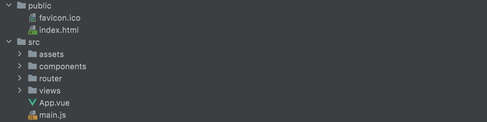

- favicon.ico: 作为 title 上 logo
- index.html: 作为整个系统唯一一个单页面
- assets:   `用来存放整个系统中使用到 img 图片`
- components: `用来存放整个系统公共组件以及非页面组件`
- router: `用来配置整个系统路由规则`
- views:  `用来存放页面组件`
- main.js: `用来全局配置 vue根实例`
- App.vue: `根组件,入口组件`

### 工具中启动项目

- 方式一
  - 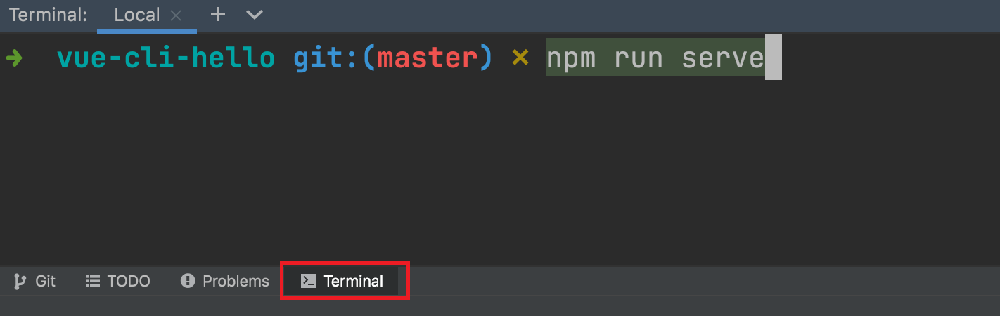
- 方式二
  - 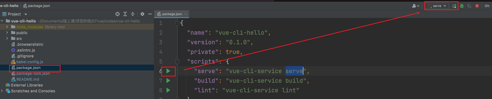

### 开启 ESLint 

- 创建项目指定为 eslint + prettier

  - 

- 创建项目选择 eslint 格式化

  - 

- 配置 Prettierr

  - 在项目根目录创建一个配置文件 .prettierrc 文件名固定

  - ```json
    {
      "semi": false, //不适用分号结尾
      "singleQuote": true //将项目中所有双引号转为单引号
    }
    ```

- 在工具中开启 eslinit

  - 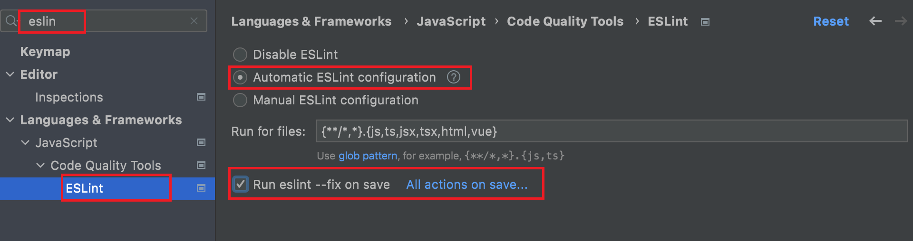

### 组件中 style 标签上 scoped 属性

- scoped 区域
  - 加入这个属性代表当前样式只能作用域当前组件

`注意:没有这个属性代表样式影响全局组件`

### 使用Axios

- 安装

  ```shell
  $ npm install axios
  ```

- 创建 utils 目录&创建 request.js

  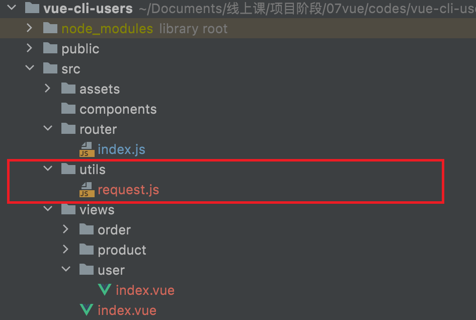

  ```js
  //引入默认 axios
  import axios from 'axios'
  
  //创建配置
  const request = axios.create({
    baseURL: 'http://localhost:8080',
    timeout: 5000,
  })
  
  //使用拦截器 请求拦截  响应拦截器
  request.interceptors.request.use((config) => {
    //请求预先处理
    console.log('request Interceptor')
    return config
  })
  request.interceptors.response.use((res) => {
    //响应结果处理
    console.log('response Interceptor')
    return res
  })
  //暴露
  export default request
  ```

- 在组件中使用

  ```javascript
  //1.引入 request
  import request from '@/utils/request'
  //2.使用 request
  request.get();
  request.post();
  .....
  ```

### 优化 Axios 使用

- 在项目创建 api 目录用来存放后端请求js

  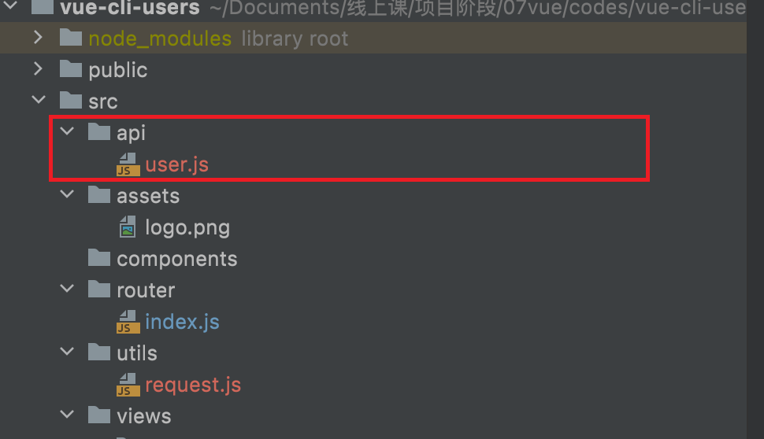

- 根据不同模块创建不同 api js 文件如 user

  ```js
  import request from '@/utils/request'
  
  /**
   * 查询所有函数
   */
  export function all(params) {
    return request({
      method: 'GET',
      url: '/users',
      params,
    })
  }
  /**
   * 查询一个
   */
  export function detail(id) {
    return request({
      method: 'GET',
      url: `/users/${id}`,
    })
  }
  
  /**
   * 保存用户
   */
  export function save(data) {
    return request({
      method: 'POST',
      url: '/users',
      data,
    })
  }
  
  /**
   * 修改用户
   */
  export function update(data) {
    return request({
      method: 'PUT',
      url: '/users',
      data,
    })
  }
  
  /**
   * 删除用户
   */
  export function deleteUser(id) {
    return request({
      method: 'DELETE',
      url: `/users/${id}`,
    })
  }
  ```

- 在组件使用

  ```js
  //1.导入使用函数
  import { all, deleteUser, detail, save, update } from '@/api/user'
  
  //2.使用函数
  函数名(参数).then(res=>{}).catch(err=>{});
  ```


### Vue Cli 打包部署

- 在项目根目录中执行打包命令

  ```shell
  npm run build
  ```

- 在项目打包之后,在项目中出现打包之后系统

  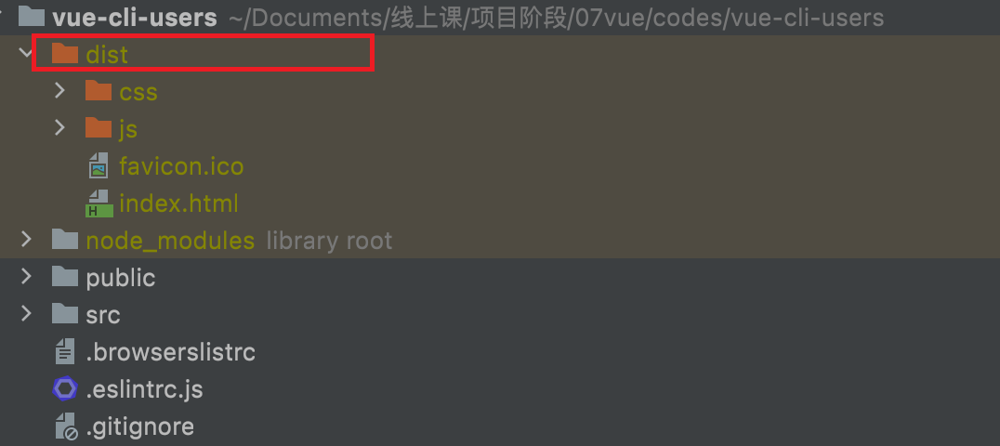

- 如何部署

  - nginx 生产中部署

    ```markdown
    # 1.拉取 nginx 镜像
    - $ docker pull nginx:1.21.4
    # 2.运行 nginx 镜像
    - $ docker run -d --name nginx01 -p 9090:80  -v dist:/usr/share/nginx/html nginx:1.21.4
    # 3.访问 nginx 端口
    - http://localhost:9090
    ```

  - 使用 anywhere 静态服务 测试

    ```markdown
    # 1.安装 anywhere 静态服务器
    - $ npm install -g anywhere
    # 2.使用 anywhere
    - a.进入 dist 根目录打开终端,在终端中执行 anywhere 
    - anywhere -p 9091
    ```

## Vuex

### 说明

​	Vuex 是一个专为 Vue.js 应用程序开发的**状态管理模式 + 库**。它采用`集中式存储`管理应用的所有组件的`状态(数据)`，并以相应的规则保证状态以一种可预测的方式发生变化。

​	Vuex 就是 vue 中提供一个全局管理共享数据一个库。

### 安装

- npm install vuex@next --save

### 配置

- 在 main.js 中引入 vuex 并使用

  ```js
  //1.引入 vuex
  import {createStore} from "vuex";
  //2.使用 创建 store 对象
  const store = createStore({});
  //3.配置 vue 使用 vuex stroe
  createApp(App).use(router).use(store).mount("#app");
  ```

### 共享数据

- 定义共享数据

  `注意:state 属性用来定义组件共享数据`

  ```js
  const store = createStore({
    state:{//状态 作用: 用来定义多个组件共享数据
      name: "zhangsan"
    }
  });
  ```

- 组件中使用共享数据

  ```js
  //使用组件的共享数据
  //this.$store.state.属性名
  this.$store.state.name
  ```

- mapState 简化写法

  ```js
  computed:{
    //用来将 vuex 中 state 对象共享数据映射到 computed 中 
    ...mapState(['name','count'])
  }
  `注意:不能映射到 data(){}函数中`
  ```

### 原理

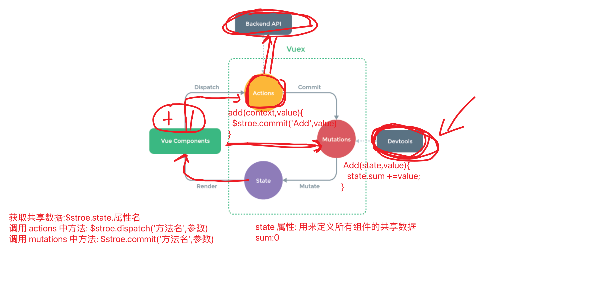

### 共享数据修改

- Actions & Mutations 

  `用来定义修改数据方法`

  ```js
  const store = createStore({
    state:{//状态 作用: 用来定义多个组件共享数据
      name: "zhangsan",
      count: 0,
    },
    actions:{
      add(context,value){//参数 1:context ministore 对象  参数 2:接收参数
        context.commit('Add',value);//调用 mutations 中的方法
      }
    },//用来定义修改共享数据方法  允许将异步处理结果进行共享数据修改
    mutations:{
      Add(state,value){
        state.count +=value;
      }
    }//用来定义修改共享数据方法 不允许异步处理
  });
  ```

  **`注意: actions 中方法运行异步处理 mutations 中方法不允许存在异步处理`**

- 调用 actions 方法

  ```java
  this.$store.dispatch('方法名',参数);
  ```

- 直接 mutations 方法

  ```js
  this.$store.commit('方法名',参数);
  ```

### 数据修改简化写法

- mapActions

  ```js
   methods:{
      incrmentCount(){
        //this.$store.dispatch("add",{name:'小陈',count:1});//调用 actions 中方法 参数 1:方法名 参数 2: 传递参数
        //this.$store.commit('Add',{name:'张三',count:2})
        this.add({name:'小三',count:3})
      },
      ...mapActions(['add']) //用来将 vuex 中 actions 中方法转为自己组件方法
    },
  ```

- mapMutations

  ```js
  methods:{
      incrmentCount(){
        //this.$store.dispatch("add",{name:'小陈',count:1});//调用 actions 中方法 参数 1:方法名 参数 2: 传递参数
        //this.$store.commit('Add',{name:'张三',count:2})
        //this.add({name:'小三',count:3})
        this.Add({name:'明明',count:5})
      },
      ...mapActions(['add']),//用来将 vuex 中 actions 中方法转为自己组件方法
      ...mapMutations(['Add']),//用来将 vuex 中 mutations 中方法转为自己组件方法
    },
  ```

### 共享数据计算

- getters 类似 computed (计算属性)

  `计算属性: 当需要对渲染结果进行二次计算时需要用到 computed`

  `getters: 相当于共享数据的计算属性,对计算结果同样进行缓存`

  ```js
  //1.定义计算方法
  const store = createStore({
    state:{//状态 作用: 用来定义多个组件共享数据
      name: "zhangsan",
      count: 0,
    },
    //....
    getters:{
      helloName(state){
        return "hello" + state.name;
      }
    }
  });
  //2.使用 getters 中定义计算属性
  $store.getters.计算属性名
  `注意:getters 中定义都是计算属性,不要再使用时候作为方法使用
  ```

- mapGetters 简化写法

  ```js
  computed:{
   //相当于将 helloName 计算属性从 vuex的 getters 中进行映射为当前组件的helloName
   ...mapGetters(['helloName'])
  }
  ```

  

- devTools 调试工具安装

  ```markdown
  # 1.下载工具
  - https://chrome.google.com/webstore/detail/vuejs-devtools/nhdogjmejiglipccpnnnanhbledajbpd
  
  # 2.直接自动安装
  ```

  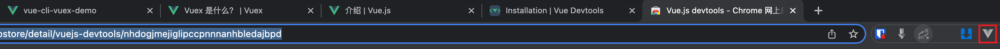

  ```markdown
  # 3.只能用在 vue 系统开发过程中
  ```

  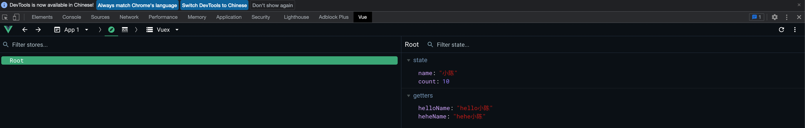

-  vuex 使用优化

  ```markdown
  # 1.创建 store 文件夹
  ```

  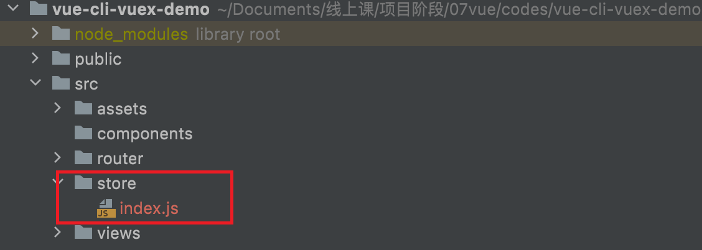

  ```markdown
  # 2.在 index.js 编写
  ```

  ```js
  //1.引入 vuex
  import {createStore} from "vuex";
  //2.使用 创建 store 对象
  export default createStore({
    state:{},//用来定义多个组件共享数据 --> $stroe.state.属性名 简化写法 mapState
    actions:{},//用来定义组件修改方法 允许存在异步方法 --> $stroe.dispatch('方法名',参数); 简化写法 mapActions
    mutations:{},//用来定义组件修改方法 不允许存在异步方法 ---> $stroe.commit('方法名',参数) 简化写法 mapMutations
    getters:{},//用来定义共享数据计算属性  ----> $stroe.getters.属性名 简化写法mapGetters
  });
  ```

## ElementUI

### 安装

- Element UI
- Naive UI
- Ant UI

```js
//1.https://element-plus.org/#/zh-CN
- npm install element-plus --save
//2.配置使用 main.js
import ElementPlus from 'element-plus'
import 'element-plus/dist/index.css'

app.use(ElementPlus)
```

### 图标安装

```js
//1.图标安装
npm install @element-plus/icons-vue
//2.引入图标
import { Edit } from '@element-plus/icons-vue'
export default {
  components: {
    Edit,
  },
}
//3.使用图标
<el-button type="info">
  <Edit style="width: 1em; height: 1em; margin-right: 8px"></Edit>
Info
</el-button>
```

### 总结

- 属性: 属性的使用直接书写在对应组件标签上给予相应值 用来设置组件初始状态

- 事件: 相当于组件内定义好的方法,在使用时直接在对应组件标签 @事件名="事件处理函数使用"

- 方法: 用来通过 js 代码方式改变组件现有状态 方法使用直接在对应标签上 加入 ref="xxx"

  调用时直接 使用 this.$refs.xxx.方法


